## Recursive Language Models 

> **Attribution and license:** This is a Markdown conversion of
> [*Recursive Language Models*, arXiv:2512.24601v3](https://arxiv.org/abs/2512.24601v3)
> by Alex L. Zhang, Tim Kraska, and Omar Khattab. The source paper is licensed
> under [CC BY 4.0](https://creativecommons.org/licenses/by/4.0/). Changes from
> the source are limited to PDF-to-Markdown conversion, formatting cleanup,
> and extraction or re-encoding of figures. Conversion errors may remain. This
> project is not endorsed by the paper's authors. See
> [Third-party notices](../../THIRD_PARTY_NOTICES.md#recursive-language-models-paper).

**Alex L. Zhang Tim Kraska Omar Khattab** MIT CSAIL MIT CSAIL MIT CSAIL `altzhang@mit.edu kraska@mit.edu okhattab@mit.edu` 

## Abstract
We study allowing large language models (LLMs) to process arbitrarily long prompts through the lens of inference-time scaling. We propose **Recursive Language Models** ( **RLM** s), a general inference paradigm that treats long prompts as part of an external _environment_ and allows the LLM to _programmatically_ examine, decompose, and _recursively call itself over_ snippets of the prompt. We find that RLMs can successfully process inputs more than an order of magnitude beyond model context window limits and, even for shorter prompts, dramatically outperform the quality of vanilla frontier LLMs and common long-context and coding scaffolds (e.g., on GPT-5 by a median across the evaluated benchmarks of 26% against compaction, 130% against CodeAct with sub-calls, and 13% against Claude Code) across four diverse long-context tasks while having comparable cost. At a small scale, we post-train the first model around the RLM. Our model, **RLM-Qwen3-8B** , outperforms the underlying Qwen3-8B model by a median of 28% and even approaches the quality of vanilla GPT-5 on three long-context tasks. Code is available at https://github.com/alexzhang13/rlm. 

## 1 Introduction 


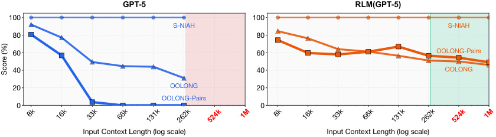


**----- Start of picture text -----**<br>
GPT-5 RLM(GPT-5)<br>100 100<br>S-NIAH S-NIAH<br>80 80<br>60 60 OOLONG-Pairs<br>40 40 OOLONG<br>20 OOLONG 20<br>OOLONG-Pairs<br>0 0<br>Input Context Length (log scale) Input Context Length (log scale)<br>8k 16k 33k 66k 131k 262k 524k 1M 8k 16k 33k 66k 131k 262k 524k 1M<br>Score (%)<br>**----- End of picture text -----**<br>


Figure 1: A comparison of GPT-5 and a corresponding RLM(recursion depth=1) using GPT-5 on three long-context tasks of increasing complexity: **S-NIAH** , **OOLONG** , and **OOLONG-Pairs** . For each task, we scale the input length from 2[13] to 2[20] . GPT-5 performance degrades significantly as a function of both input length and task complexity, while the RLM maintains strong performance. Inputs beyond the red region do not fit in GPT-5’s context window of 272K tokens, but the RLM handles them effectively. Additional experiments across other models and benchmarks are in §3. 

Frontier reasoning models have limited context windows and, even within their limits, tend to exhibit _context rot_ [Hong et al., 2025], a phenomenon illustrated in Figure 1 where quality degrades steeply as prompts get longer. Though we expect context lengths to steadily rise through improvements to training, architecture, and infrastructure, we are interested in _whether it is possible to scale the context size of general-purpose LLMs by orders of magnitude_ . This is increasingly urgent as LLMs 

Correspondence to Alex L. Zhang, Omar Khattab < `altzhang@mit` _._ `edu` , `okhattab@mit` _._ `edu` >. 

Preprint. 

begin to be widely adopted for long-horizon tasks, in which they must routinely process tens if not hundreds of millions of tokens. 

We study this question through the lens of scaling inference-time compute. We are inspired by the way that _reasoning models_ , another inference strategy, have become the fundamental interface to LLMs, resulting not only in empirical gains but also additional theoretical expressive power [Merrill and Sabharwal, 2024] compared to vanilla Transformers. Though most inference-time methods for dealing with long context are task-specific [Wu et al., 2021, Chang et al., 2024], the most popular general approach is _context condensation_ or _compaction_ [Khattab et al., 2021, Smith, 2025, OpenAI, 2025b, Wu et al., 2025], where context from user requests or agent trajectories is repeatedly summarized once it exceeds a length threshold. Unfortunately, compaction is rarely expressive enough for tasks that require dense access throughout the prompt. It presumes that _some_ details that appear early in the prompt can safely be forgotten to make room for new content. 


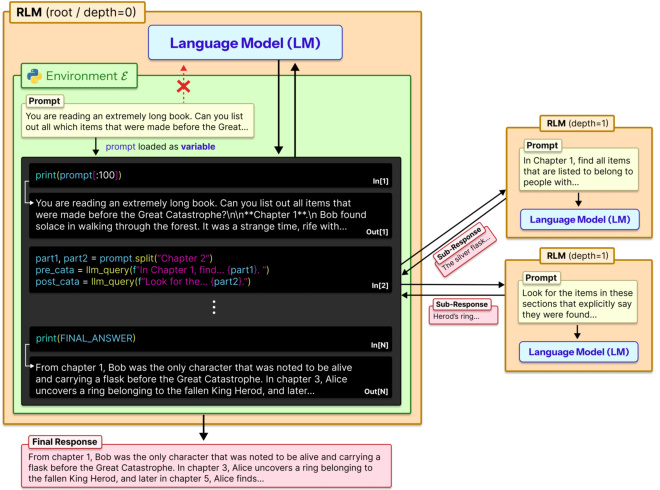


Figure 2: A Recursive Language Model (RLM) treats prompts as part of the environment. It loads the input prompt as a variable inside a REPL environment _E_ and writes code to peek into, decompose, and invoke itself recursively over programmatic snippets of the variable. 

We introduce **Recursive Language Models** ( **RLM** s), a general-purpose inference paradigm for dramatically scaling the effective input and output lengths of LLMs. The key insight is that arbitrarily long user prompts should not be fed into the neural network (e.g., Transformer) directly but should instead be treated as _part of the environment that the LLM is tasked to_ _**symbolically and recursively** interact with_ . This system serves as an abstracted “language model” without context limitations. 

As Figure 2 shows, an RLM exposes the same external interface as an LLM or a reasoning model: it accepts a string prompt of arbitrary structure and produces a string response. Given a prompt _P_ , the RLM initializes a Read-Eval-Print Loop (REPL) programming environment in which _P_ is set as the value of a variable. It then offers the LLM general context about the REPL environment (e.g., the length of the string _P_ ), and permits it to write code that peeks into and decomposes _P_ , and to iteratively observe any side effects from execution. Crucially, RLMs encourage the LLM to understand, transform, and execute the input prompt by _writing symbolic programs that invoke the LLM itself_ on as many slices of the input as necessary. 

By treating the prompt itself as an external object and enabling symbolic recursion, RLMs tackle limitations of expressive power in recent work on coding agents, retrieval agents, and sub-agent delegation. In particular, prior coding agents and retrieval agents treat some designated external data source (e.g., a filesystem or a corpus of search documents) as an environment for fetching snippets. However, they can only fill up the underlying LLM’s context window with snippets before facing compaction. Similarly, prior self-delegation approaches [Anthropic, 2025, Sentient AI, 2025, Schroeder et al., 2025, Sun et al., 2025] allow LLMs to invoke themselves as sub-agents. However, 

2 

they are handicapped by the underlying LLM’s limited output lengths because they are designed to verbalize sub-calls autoregressively rather than producing them programmatically. 

We evaluate RLMs using a frontier closed model (GPT-5; Singh et al. 2025) and a frontier open model (Qwen3-Coder-480B-A35B; Qwen Team 2025b) across four tasks with varying levels of complexity: deep research [Chen et al., 2025], information aggregation [Bertsch et al., 2025], code repository understanding [Bai et al., 2025], and a synthetic pairwise reasoning task where even frontier models fail catastrophically. We compare RLMs against direct LLM calls as well as context compaction, retrieval tool-use agents, and code-generation agents with and without sub-calls. 

We find that RLMs demonstrate extremely strong performance even at the 10M+ token scale, and substantially outperform other approaches at long-context processing, in many cases by double-digit percentage gains while maintaining comparable cost. In particular, as demonstrated in Figure 1, RLMs exhibit far less severe degradation for longer contexts and more sophisticated tasks. 

Finally, at a small scale, we post-train the first natively recursive language model, demonstrating that RLMs can be improved quickly with little additional training. While a small open model (Qwen3-8B; Yang et al. 2025) struggles to solve long context tasks even in an RLM scaffold, our simple general-purpose training recipe uses only 1,000 samples from unrelated domains to improve its performance by a median of 28.3% across the four evaluation tasks. 

## 2 Recursive Language Models 

Given a base neural language model _M_ with maximum context size _K_ , a Recursive Language Model (RLM) is an inference-time scaffold around _M_ that treats the user prompt as part of the environment without giving up the ability to densely process its content through different calls to _M_ . Given an arbitrary-length prompt string _P_ ∈ Σ* , an RLM interacts with a persistent external environment _E_ and returns a response string _Y_ ∈ Σ* (Figure 2). We would like effectively _unbounded input tokens_ ( _|P | ≫ K_ ), _unbounded output tokens_ , and an _unbounded semantic horizon_ , e.g. the ability to do Ω(|P|) or Ω(|P|²) semantic work. 

Algorithm 1 describes how an RLM achieves this. Given a prompt _P_ , the RLM initializes a persistent REPL programming environment with a variable containing the user prompt as a string and a function for invoking a sub-RLM with a new prompt. Then, it starts the RLM loop. In the first iteration, the algorithm invokes the _root_ neural model _M_ with only (constant-size) metadata about the user prompt, like its length, a short prefix, and how to access parts of it. 

The root is instructed via prompting (Appendix C) and/or fine-tuning (Appendix A) to operate like an RLM: that is, to _generate code that helps it understand and transform parts of its prompt P_ , and to build up intermediate values and the final response into new variables, potentially by _invoking the sub-RLM within loops_ . In Section 4, we find that existing LLMs can be prompted to do this and that training an 8B model to be natively recursive is promising. 

Each iteration of the RLM loop executes code in the REPL, updates REPL state (intermediate variables), and collects in `stdout` any printed text. Only (constant-size) metadata about `stdout` , like a short prefix and length, is appended to _M_ ’s history for the next iteration.[2] Once the RLM sets the variable `Final` inside the REPL, iteration stops and the value in `Final` is returned as the response. 

RLMs make three simple design choices that are missing from many existing scaffolds. To highlight these, we include Algorithm 2 to illustrate a deceptively “similar” algorithm that is far less expressive. Both algorithms support some notion of sub-calls, external objects, and code execution, but they differ in terms of where the prompt and intermediate values live and where recursion occurs. 

First, an RLM must give the underlying LLM _M_ a _symbolic handle_ to the user prompt _P_ , so the model can manipulate it without copying text into the root context window. Instead, ineffective Algorithm 2 starts by putting the user prompt _P_ into the LLM context window ( `hist` ), inheriting the window limitations of _M_ and falling back to heuristics like context compaction. Even though the scaffold can access external data with, say, a `Search` action, it is bounded with respect to user input. 

> 2This is key: it forces _M_ to rely on variables and sub-calls to manage long strings instead of polluting its window. In principle, if we trim each turn to _c_ tokens, we will have at most _K/c_ root iterations, each of which can launch arbitrarily many sub-calls. This is not a fundamental limitation, e.g. one could move the root horizon itself into a variable, but we typically want to limit the iterations at any level of recursion irrespective. 

3 

**Algorithm 1:** A recursive language model, around LLM _M_ , which itself acts as a “language model”. 

**Input:** prompt _P_ **Output:** response _Y_ `state` _←_ `InitREPL(prompt=P) state` _←_ `AddFunction(state` , `sub_RLM` _M_ `) hist` _←_ [ `Metadata(state)` ] **while** _True_ **do** `code` _←_ `LLM` _M_ `(hist)` ( `state` , `stdout` ) _←_ `REPL(state, code) hist` _←_ `hist` _∥_ `code` _∥_ `Metadata(stdout)` **if** _`state[Final]` is set_ **then return** `state[Final]` 

**Algorithm 2:** Alternate scaffold with standard (poor) design choices. 

**Input:** prompt _P_ **Output:** response _Y_ `actions` _←{_ `Finish` _,_ `Exec` _,_ `Search` _,_ `sub_LLM` _M}_ `hist` _←_ [ `Metadata(actions)` _, P_ ] Flaw #1 **while** _True_ **do** ( `action` , `val` ) _←_ `LLM` _M_ `(hist)` **if** _`action` is_ _`Finish`_ **then return** `val` Flaw #2 `out` _←_ `RUN(action, val)` Flaw #3 `hist` _←_ `hist` _∥_ ( `action` , `val` , `out` ) **if** _`Tok(hist)` > K_ **then** `hist` _←_ `Compact(hist)` 

Second, ineffective Algorithm 2 asks _M_ to generate the output directly, via a `Finish` action. This may seem innocuous, but it means outputs cannot be longer than the context window of _M_ . 

Third, and perhaps most importantly, an RLM requires _symbolic recursion_ . That is, code running _inside E_ must be able to invoke _M_ on programmatically constructed transformations of _P_ (e.g., inside arbitrarily large loops), storing intermediate results symbolically. Though Algorithm 2 includes both a code execution action and a “sub-LLM” action separately, it is not able to invoke the sub-LLM programmatically and hence can only delegate a few _explicitly verbalized tasks_ rather than writing short programs that can, say, loop over slices of the prompt and launch Ω(|P|) or even Ω(|P|²) processes to understand or transform all parts of _P_ . 

We implement our RLM definition in Algorithm 1 as follows: we equip an LLM with a Python REPL, where all tools, including sub-LM or sub-RLM calls, are available as modules. The initial prompt is stored as a variable in the REPL. The LLM interacts in a loop until it provides a final answer, which can be from either a variable in the REPL, or from the LLM itself. The LLM can also print from the REPL, but it is truncated to prevent overflowing the context too quickly. 

## 3 Scaling Long Context Tasks 

We hypothesize that the effective context window [Hsieh et al., 2024, Goldman et al., 2025, Hong et al., 2025] of an LLM cannot be understood independently of the _specific task_ . That is, more “complex” problems will exhibit degradation at even _shorter_ lengths than simpler ones. Because of this, we must characterize tasks in terms of how their complexity _scales with prompt length_ . 

For example, needle-in-a-haystack (NIAH) problems generally keep ‘needles’ constant as prompt length is scaled. As a result, frontier models can now reliably solve these tasks in RULER [Hsieh et al., 2024] in the 1M+ token settings but struggle at far shorter lengths on OOLONG [Bertsch et al., 2025], a task where the answer depends explicitly on almost every line in the prompt.[3] 

## 3.1 Tasks 

We design our evaluation around tasks where we can vary the lengths of the prompts, so we can consider problems whose difficulties scale differently with context length. 

**S-NIAH** . Following the single needle-in-the-haystack task in RULER [Hsieh et al., 2024], we consider a set of 50 single tasks that require finding a specific phrase or number in a large set of unrelated text. Here, the information being sought scales as _O_ (1) with respect to input length. 

**BrowseComp-Plus (1K documents)** [Chen et al., 2025]. A multi-hop question-answering benchmark for DeepResearch [OpenAI, 2025a] questions that requires reasoning over multiple different 

> 3This helps explain the patterns seen in Figure 1 earlier: GPT-5 scales effectively on the S-NIAH task, where the needle size is constant despite longer prompts, but shows faster degradation at increasingly _shorter_ context lengths on the _linear_ -complexity OOLONG and the _quadratic_ -complexity OOLONG-Pairs. 

4 

documents in an offline corpus. Following Sun et al. [2025], we use 150 randomly sampled instances as our evaluation set; we provide 1000 randomly chosen documents as input, in which the gold and evidence documents are guaranteed to exist. We report the percentage of correct answers. The answer to each task requires piecing together information from several documents, making this harder than **S-NIAH** despite also requiring a constant number of documents. 

**OOLONG** [Bertsch et al., 2025]. A long reasoning benchmark that requires semantically labeling and aggregating these labels to form a final answer. We focus specifically on the `trec_coarse` split, a set of 50 tasks over a dataset of questions with semantic labels. Each task requires using nearly all dataset questions, and therefore scales linearly in processing complexity relative to the input length. 

**OOLONG-Pairs** . A modified variant of the `trec_coarse` split of OOLONG with 20 queries that specifically require aggregating _pairs_ of chunks to construct the final answer. We report F1 scores over the answer, which is a list of entries. Each task requires using nearly all _pairs_ of entries of the dataset, and therefore requires processing quadratically-many items relative to the input length. In Appendix D.1, we list all queries in this benchmark. 

**LongBench-v2 CodeQA** [Bai et al., 2025]. A multi-choice code repository understanding split from LongBench-v2 that is challenging for modern frontier models. Each instance requires reasoning over a fixed number of files in a codebase to find the right answer. 

## 3.2 Methods and Baselines 

We compare RLMs against commonly used task-agnostic inference methods, using two modern LMs, GPT-5 with medium reasoning [Singh et al., 2025] and default sampling parameters, and Qwen3-Coder-480B-A35B [Yang et al., 2025] using the sampling parameters described in Qwen Team [2025b]. For Qwen3-Coder-480B-A35B, we compute costs based on the compute provider Fireworks [Fireworks AI, 2025]. In addition to evaluating the base model on all tasks, we also evaluate the following methods and baselines: 

**CodeAct.** We compare directly to a CodeAct [Wang et al., 2024] agent that can execute code inside of a ReAct [Yao et al., 2023] loop. Unlike an RLM, CodeAct does not offload the user prompt to the code environment, and instead provides it directly to the LM. We consider two variants: (1) a version following Jimenez et al. [2024], Chen et al. [2025] where we equip this agent with a BM25 [Robertson and Zaragoza, 2009] retriever; (2) a version with a sub-call tool inside of the REPL. Compared to RLMs, this method loads the context directly into the model. 

**Compaction agent.** Following Sun et al. [2025], Wu et al. [2025], Yu et al. [2025], we consider an iterative agent that compacts the context as it is filled. For example, given a corpus of documents, it will iteratively accumulate the documents and summarize when full. In cases where a single document exceeds the model window, the agent will chunk the document and iteratively compact it. For the GPT-5 experiments, due to the extremely high cost of applying this strategy to millions of tokens, we use GPT-5-nano for compaction and GPT-5 to provide the final answer. 

**Coding agents.** We compare against commonly used coding agents like OpenCode [Anomaly, 2026] and Claude Code [Anthropic, 2025]. We consider two variants, one where the context is offloaded to a file, and another where it is directly used as the initial prompt. Closed source agents like Claude Code are designed around a corresponding model, so we use Claude Opus 4.1 with Claude Code v2.0.0 (released around the same time as the GPT-5 model we use in our main results) for this baseline. 

**RLM** . We implement an RLM with a Python REPL environment, which loads a module for querying a sub-LM and uses a system prompt presented in Appendix C. For the GPT-5 experiments, we use GPT-5-mini for the recursive LMs and GPT-5 for the root LM, as we found this choice to strike a good balance between the capabilities of RLMs and the cost of the recursive calls. We also evaluate several different max recursion depths allowable to the RLM, from 0-3. Max recursion depth 0 is an RLM without sub-calling capabilities. Max recursion depth 1 allows sub-calling LLMs, while max depth >1 allows sub-calling RLMs. We notate a RLM with max recursion depth _N_ using a model as RLM(model, depth= _N_ ), e.g. RLM(GPT-5, depth=2), and assume depth=1 if not stated otherwise. 

**Fine-tuning.** To create **RLM-Qwen3-8B** , we fine-tune Qwen3-8B on 1,000 filtered trajectories of Qwen3-Coder-480B-A35B as an RLM with Qwen3-8B sub-calls on LongBenchPro [Chen et al., 2026] tasks. We use sampling parameters described in Qwen Team [2025a], and evaluate the finetuned RLM-Qwen3-8B as an RLM. The key insight for training is that being an effective sub-call 

5 

model is roughly similar to being a general purpose reasoning model, so we can make the training much more tractable at small scale by focusing on improving the root model’s ability to manipulate the REPL and to launch recursive calls. We provide more training details in Appendix A. 

## 4 Results and Discussion 

Table 1 reports our main evaluation results. We additionally explore how vanilla frontier model and RLM performance degrade as input contexts grow in Figure 1. 

Table 1: Performance comparison of different methods across long-context benchmarks of varying complexity. In gray is the average API cost _±_ the standard deviation of each method on each task. _∗_ indicates runs where a method (sometimes) ran into input context limits. Provider costs were computed under OpenAI for GPT-5, under Fireworks for Qwen3 models, and under Anthropic for Claude Opus 4.1. All non-zero scores are rounded to at least 0 _._ 1. 

|**Model**|**CodeQA**|**BrowseComp+ (1K)**|**OOLONG**|**OOLONG-Pairs**|
|---|---|---|---|---|
|**Task Length**_N_ **(tokens)**|23K-4.2M|6M-11M|131K|32K|
|**GPT-5** (with RLM sub-calls to GPT-5-mini)|||||
|Base Model|24.0_∗_($0.13_±_$0.07)|0.0_∗_(N/A)_±_(N/A)|44.0 ($0.14_±_$0.02)|0.1 ($0.16_±_$0.10)|
|CodeAct (+ BM25)|22.0_∗_($0.06_±_$0.08)|51.0 ($0.71_±_$1.20)|38.0 ($0.61_±_$1.06)|24.7 ($0.75_±_$0.43)|
|CodeAct (+ sub-calls)|24.0_∗_($0.06_±_$0.08)|0.0_∗_(N/A)_±_(N/A)|40.0 ($0.85_±_$1.27)|28.4 ($1.11_±_$0.62)|
|Compaction agent|58.0 ($1.31_±_$1.46)|70.5 ($0.57_±_$0.10)|46.0 ($0.13_±_$0.01)|0.1 ($0.13_±_$0.09)|
|OpenCode|18.0_∗_(N/A)_±_(N/A)|0.0_∗_(N/A)_±_(N/A)|32.0 (N/A)_±_(N/A)|3.1 (N/A)_±_(N/A)|
|OpenCode (+ context offoading)|64.0 (N/A)_±_(N/A)|**94.0** (N/A)_±_(N/A)|52.0 (N/A)_±_(N/A)|4.8 (N/A)_±_(N/A)|
|RLM (recursion depth=0)|58.0 ($0.18_±_$0.56)|88.0 ($0.44_±_$0.90)|36.0 ($0.37_±_$0.42)|43.9 ($0.69_±_$1.16)|
|RLM (recursion depth=1)|62.0 ($0.11_±_$0.10)|91.3 ($0.99_±_$1.22)|56.0 ($0.43_±_$0.85)|58.0 ($0.33_±_$0.20)|
|RLM (recursion depth=2)|**66.0** ($0.15_±_$0.30)|92.0 ($0.55_±_$0.69)|56.5 ($1.10_±_$3.25)|65.5 ($0.33_±_$0.44)|
|RLM (recursion depth=3)|58.0 ($0.15_±_$0.27)|92.0 ($0.51_±_$0.54)|**58.0** ($0.51_±_$0.54)|**76.0** ($0.39_±_$0.32)|
|**Qwen3-Coder-480B-A35B**|||||
|Base Model|20.0_∗_($0.13_±_$0.08)|0.0_∗_(N/A)_±_(N/A)|36.0 ($0.06_±_$0.00)|0.1 ($0.05_±_$0.01)|
|CodeAct (+ BM25)|24.0_∗_($0.17_±_$0.08)|12.7 ($0.39_±_$0.50)|38.0 ($1.51_±_$1.09)|0.3 ($1.54_±_$0.35)|
|CodeAct (+ sub-calls)|26.0_∗_($0.28_±_$0.30)|0.0_∗_(N/A)_±_(N/A)|32.0 ($1.83_±_$1.14)|0.1 ($1.49_±_$0.46)|
|Compaction agent|50.0 ($1.26_±_$1.50)|38.0 ($8.98_±_$2.12)|44.1 ($0.15_±_$0.01)|0.31 ($0.05_±_$0.00)|
|OpenCode|12.0_∗_(N/A)_±_(N/A)|0.0_∗_(N/A)_±_(N/A)|36.0 (N/A)_±_(N/A)|0.0 (N/A)_±_(N/A)|
|OpenCode (+ context offoading)|40.0 (N/A)_±_(N/A)|58.0 (N/A)_±_(N/A)|24.0 (N/A)_±_(N/A)|2.1 (N/A)_±_(N/A)|
|RLM (recursion depth=0)|**66.0** ($0.18_±_$0.58)|46.0 ($0.82_±_$0.69)|43.5 ($0.32_±_$0.13)|17.3 ($1.77_±_$1.23)|
|RLM (recursion depth=1)|56.0 ($0.92_±_$1.23)|44.7 ($0.84_±_$0.63)|**48.0** ($0.61_±_$0.49)|**23.1** ($1.02_±_$0.52)|
|RLM (recursion depth=2)|54.0 ($1.88_±_$3.30)|68.0 ($1.05_±_$0.67)|26.0 ($1.03_±_$1.65)|19.0 ($1.61_±_$0.99)|
|RLM (recursion depth=3)|44.0 ($1.65_±_$1.63)|**68.7** ($1.10_±_$0.80)|32.0 ($0.80_±_$1.03)|21.1 ($1.67_±_$1.21)|
|**Claude Opus 4.1**|||||
|Claude Code|12.0_∗_($2.03_±_$0.57)|0.0_∗_(N/A)_±_(N/A)|40.2 ($3.43_±_$1.60)|0.1 ($6.75_±_$3.57)|
|Claude Code (+ context offoading)|62.0 ($1.25_±_$0.54)|84.0 ($2.03_±_$1.49)|48.0 ($0.98_±_$0.55)|6.5 ($2.99_±_$1.16)|


**Observation 1: RLMs can scale to the 10M+ token regime and can outperform base LMs and existing task-agnostic agent scaffolds on long context tasks** . Across all tasks, RLMs demonstrate strong performance on prompts well beyond the effective context window of a frontier LM, outperforming base models and common long-context scaffolds by up to 2 _×_ the performance while maintaining comparable or cheaper average token costs. Notably, RLMs scale well beyond the base models’ context window. For instance, on BrowseComp-Plus (1K), a linearly extrapolated cost for GPT-5-mini ingesting 6-11M input tokens is $1 _._ 50 _−_ $2 _._ 75, while RLM(GPT-5, depth=1) has an average cost of $0 _._ 99 and outperforms both the compaction and retrieval baselines by over 29%. 

Furthermore, on tasks where processing costs scale with the input context, RLMs make significant improvements over the base model, even on tasks within the model’s context window. On OOLONG, the RLM(depth=1) with GPT-5 and Qwen3-Coder outperform the base model by 28 _._ 4% and 33 _._ 3% respectively. On OOLONG-Pairs, both GPT-5 and Qwen3-Coder make little progress with F1 scores of _≤_ 0 _._ 1%, while the RLM(depth=1) using these models achieve F1 scores of 58 _._ 0% and 23 _._ 1% respectively, highlighting the capability of RLMs to handle extremely information-dense tasks. 

6 

**Observation 2: The REPL is necessary for handling long inputs, while the recursive sub-calling of RLMs provides strong benefits on information-dense inputs.** A key characteristic of RLMs is offloading the context as a variable in an environment _E_ that the model can interact with. In particular, RLM(depth=0) and coding agents like Claude Code and OpenCode are able to scale beyond the context limit of the model and outperform other task-agnostic baselines on most long context settings. On CodeQA in particular with Qwen3-Coder-480B-A35B, the no-sub-calling RLM(depth=0) is able to outperform all sub-calling variants of the RLM. 

On information-dense tasks like OOLONG or OOLONG-Pairs, we observed several cases where programmatic recursive LM sub-calling is necessary. In §5, we see RLM(Qwen3-Coder) perform the necessary semantic transformation line-by-line through recursive sub-calls, while the ablation without sub-calls is forced to use keyword heuristics to solve these tasks. On OOLONG-Pairs in particular, the higher recursive depth variants of the RLM for GPT-5 outperform all other methods including Claude Code and OpenCode by a large margin. 

**Observation 3: LM performance degrades as a function of input length and problem complexity, while RLM performance scales better.** The benchmarks S-NIAH, OOLONG, and OOLONG-Pairs contain a fixed number of tasks over contexts with lengths ranging from 2[13] to 2[20] . Each benchmark can be categorized by different processing complexity of the input context with respect to length (roughly constant, linear, and quadratic respectively). In Figure 1, we directly compare an RLM(GPT5, depth=1) to base GPT-5, and find that GPT-5 performance degrades significantly faster for more complex tasks, which aligns with the findings of Goldman et al. [2025], while RLM performance degrades at a slower rate. For context lengths beyond 2[14] , the RLM consistently outperforms GPT-5. 

Furthermore, RLM costs scale proportionally to the complexity of the task, while still remaining in the same order of magnitude of cost as GPT-5 (see Figure 16 in Appendix F). In §5, we explore the choices that the RLM makes that cause these differences in cost. 

**Observation 4: The inference cost of RLMs remains comparable to other methods, and in some cases base LM calls.** On average, we find in Table 1 that the inference cost of RLMs is cheaper or comparable to most other baselines, including standard coding agents. Furthermore, in Figure 11 in Appendix F, we find that the median RLM run is cheaper than the median base model run, but more expensive on average due to outlier trajectories where the RLM struggles to find an answer. 

We additionally report runtime numbers of each method in Figures 12, 13 in Appendix F, but we note several important caveats. Unlike API costs, these numbers are heavily dependent on implementation details such as the machine used, API request latency, and the asynchrony of LM calls. In our implementation of the baselines and RLMs, all LM calls are blocking / sequential. Nevertheless, similar to costs, we observe a wide range of runtimes, especially for RLMs. 

Table 2: Solve rate on LONGCOT-MINI [Motwani et al., 2026], a difficult long reasoning benchmark that frontier models struggle to solve. We select the best performing model from the paper (GPT-5.2) and compare to an RLM with and without decomposition hints (prompt provided in Appendix C.3). 

|**Model**|**Overall **|**MATH **|**CHEM**|**CS**|**LOGIC **|**CHESS**|
|---|---|---|---|---|---|---|
|GPT-5.2 (base)|38.7|26.0|37.0|40.4|53.6|36.6|
|RLM (GPT-5.2, recursion depth=1)|50.6|5.6|50.0|11.0|86.7|93.0|
|RLM (GPT-5.2, recursion depth=1) + decomposition hints|**65.6**|**32.0**|**52.0**|**46.0**|**99.0**|**99.0**|


**Observation 5: Beyond long-context, RLMs enable longer reasoning capabilities.** In Table 2, we report RLM performance on LongCoT-mini [Motwani et al., 2026], a challenging long reasoning benchmark where frontier models solve compositional problems containing interdependent subproblems. We compare with the best model reported in the paper, GPT-5.2, and find that RLM(GPT-5.2, depth=1) uses the REPL to outperform the base model. Furthermore, when providing explicit hints on how to decompose tasks, we find the RLM is able to reliably generate a graph of the problem, solving each node using sub-calls as it programmatically traverses the reasoning graph. It outperforms the base model on all domains and by a 69 _._ 5% performance increase overall. 

**Observation 6: Training RLMs on one domain can improve general downstream RLM performance, as well as efficiency. Training also exhibits length generalization.** Certain behaviors in RLM trajectories are common among different domains, such as probing the input and recursively sub-calling on shorter contexts. In Figure 3(a), we find that **RLM-Qwen3-8B** , a Qwen3-8B model 

7 

that we fine-tuned on RLM(Qwen3-Coder-480B-A35B) trajectories on a small, _unrelated_ set of tasks (LongBenchPro; Chen et al. 2026) considerably outperforms the base Qwen3-8B as a RLM across all tasks. Furthermore, its inference costs are much lower and more than 3 _×_ faster (see Figure 6 in Appendix A) due to better decision making and fewer mistakes as a RLM. Furthermore, we find that training RLMs exhibits length generalization; in Figure 3(b), we train Qwen3-4B-Instruct-0527 as an RLM(depth=1) on MRCRv2 [Vodrahalli et al., 2024], a synthetic long-context task where the model must count and reproduce instances of a body of text in a corpus. By purely training through reinforcement learning with verifiable rewards (RLVR) on a smaller split, we find that RLM(Qwen3-4B-Instruct-0527) is able to generalize to the longer, more difficult split. 


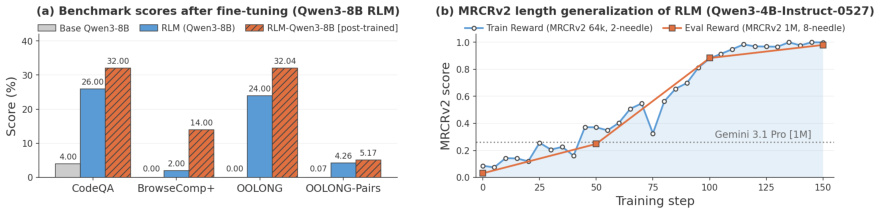


Figure 3: (a) We show how rejection fine-tuning Qwen3-8B on distilled RLM(Qwen3-Coder-480BA35B) trajectories improves performance on the benchmarks in Table 1. (b) On MRCRv2 [Vodrahalli et al., 2024], RL training RLM(Qwen3-4B-0527-Instruct) on the 64k sequence length, 2-needle split generalizes to the 1M, 8-needle split. We also show the 1M, 8-needle score for a 1M-context frontier model (Gemini 3.1 Pro [Google Gemini Team, 2026]). 

## 5 Analyses of RLM Trajectories 

RLMs exhibit interesting context and problem decomposition behavior. We discuss observable behavior in small and large LLMs as RLMs to understand how we can steer and improve their performance and efficiency through training and prompt tuning. 

**Observed RLM decomposition patterns.** Current models as RLMs attempt to probe, then decompose a task into sub-tasks for recursive sub-calls to solve. In many cases such as on BrowseComp-Plus, the LM uses model priors to programmatically narrow the search space of sub-calls. RLMs are also able to output beyond their context window by stitching together sub-LM calls inside the REPL, which is required to solve tasks like OOLONG-Pairs. We detail particular trajectories in Appendix E. 


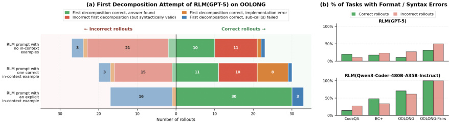


Figure 4: (a) On OOLONG, we report the performance of RLM(GPT-5) by varying the in-context examples provided in the system prompt. For each rollout, we categorize the first task decomposition attempt made by the RLM. (b) From the RLM(depth=1) runs in Table 1, we report, bucketed by correct or incorrect rollouts, the percentage of RLM trajectories with at least one syntax error. 

**First decomposition and errors in RLM trajectories.** RLMs defer essentially unbounded-length reasoning chains to sub-LM calls. The choice of decomposition can greatly affect task performance, especially for information-dense problems. In Figure 4(a), we ablate how sensitive RLM behavior is to in-context decomposition examples in its system prompt on OOLONG. We find that in-context RLM trajectories greatly improve both overall performance and the initial decomposition attempt made by 

8 

the RLM, even if the example is unrelated to the actual task. Furthermore, while RLMs frequently recover from an initially incorrect decomposition pattern, we find that the first decomposition attempt is important for overall performance. In Figure 4(b), we plot how many RLM(depth=1) trajectories in Table 1 contains syntax errors. We find that RLM(Qwen3-Coder) trajectories contain significantly more syntax errors, even for correct trajectories, compared to RLM(GPT-5). These errors explain why higher recursion depths for RLM(Qwen3-Coder) _perform worse on average_ : Qwen3-Coder-480BA35B often makes syntax errors that result in failed outputs, and having sub-RLM calls propagates this issue to sub-calls. We include additional analysis for erroneous RLM behavior in Appendix F.1. 

## 6 Related Works 

**Long-Context LM Systems.** There have primarily been two orthogonal directions for long-context management in language model systems: 1) directly changing the architecture of and retraining the base LM to handle longer contexts [Press et al., 2022, Gu et al., 2022, Munkhdalai et al., 2024], and 2) building a scaffold around the LM that implicitly handles the context – RLMs focus on the latter. One popular class of such strategies is _lossy_ context management [Chen et al., 2023], which uses compaction or truncation to compress the input context at the cost of potentially losing fine-grained information. For example, ReSum [Wu et al., 2025] adds a summarization tool to periodically compress the context of a multi-turn agent. Another class of strategies implement an explicit memory hierarchy in the agent scaffold [Packer et al., 2024, Chhikara et al., 2025, Zhang et al., 2025]. RLMs differ from these works in that all context window management is implicitly handled by the LM itself. 

**Task Decomposition through sub-LM calls.** Many LM-based agents [Guo et al., 2024, Anthropic, 2025] use multiple, well-placed LM calls to solve a problem; however, many of these calls are placed based on human-engineered workflows. Several methods like ViperGPT [Surís et al., 2023], THREAD [Schroeder et al., 2025], ReDel [Zhu et al., 2024], Context Folding [Sun et al., 2025], and AgentFold [Ye et al., 2025] have explored deferring the choice of sub-LM calls to the LM. These techniques emphasize _task_ decomposition through recursive LM calls, but are unable to handle long context inputs beyond the length of the base LM. DisCIPL [Grand et al., 2025] generates programs with sub-LM calls, but these programs are generated in a single-step and cannot recover from generation mistakes. RLMs, on the other hand, are enabled by an extremely simple intuition (i.e., placing the prompt in the external environment) to _symbolically_ manipulate arbitrarily long strings and to iteratively refine their recursion via execution feedback from the persistent REPL. 

## 7 Limitations and Future Work 

While RLMs show strong performance on tasks beyond the context window limitations of existing LMs at reasonable inference costs, evaluations for more difficult and natural long-context processing tasks and the best mechanisms for implementing guardrails for RLMs both remain highly underexplored. Broadly, RLMs add a layer of complexity on top of existing LMs that may lead to unintentional side-effects like exploding sub-call costs, which we leave for future work to solve. We also note that future strategies involving asynchronous sub-calls and sandboxed REPLs can potentially significantly reduce the runtime and inference cost of RLMs, but further contribute to this complexity. We include additional limitations and negative results in Appendix B. 

Lastly, we focused our experiments on evaluating RLMs using _existing_ frontier models, but show initial evidence on a Qwen3-8B model that explicit training as a RLM provides very rapid performance improvements, even outside the training domain. We hypothesize that RLM trajectories can be viewed as a form of reasoning [OpenAI et al., 2024, DeepSeek-AI et al., 2025], which can be trained by bootstrapping existing models [Zelikman et al., 2022, 2024]. We hope that training native RLMs can be treated as a new axis of scale to improve LM performance on general and long-horizon tasks. 

## 8 Conclusion 

We introduced Recursive Language Models (RLMs), a general inference framework for language models that offloads the input context and enables language models to recursively sub-query language models before providing an output. We explored an instantiation of this framework that offloads the context into a Python REPL environment as a variable in memory, enabling the LM to reason 

9 

over its context in code and recursive LM calls, rather than purely in token space. Our results across multiple settings and models demonstrated that RLMs are an effective task-agnostic paradigm for both long-context problems and general reasoning. Building on our small fine-tuning experiments, we are excited to see future work that explicitly trains models to reason as RLMs, which could result in another axis of scale for the next generation of language model systems. 

## References
Anomaly. opencode: The open source ai coding agent, 2026. URL `https://github` _._ `com/ anomalyco/opencode` . 

- Anthropic. Claude code: Subagents — modular ai workflows with isolated agent contexts, 2025. URL `https://docs` _._ `anthropic` _._ `com/en/docs/claude-code/sub-agents` . 

- Yushi Bai, Shangqing Tu, Jiajie Zhang, Hao Peng, Xiaozhi Wang, Xin Lv, Shulin Cao, Jiazheng Xu, Lei Hou, Yuxiao Dong, Jie Tang, and Juanzi Li. Longbench v2: Towards deeper understanding and reasoning on realistic long-context multitasks, 2025. URL `https://arxiv` _._ `org/abs/ 2412` _._ `15204` . 

- Amanda Bertsch, Adithya Pratapa, Teruko Mitamura, Graham Neubig, and Matthew R. Gormley. Oolong: Evaluating long context reasoning and aggregation capabilities, 2025. URL `https: //arxiv` _._ `org/abs/2511` _._ `02817` . 

- Yapei Chang, Kyle Lo, Tanya Goyal, and Mohit Iyyer. Booookscore: A systematic exploration of book-length summarization in the era of LLMs. In _The Twelfth International Conference on Learning Representations_ , 2024. URL `https://arxiv` _._ `org/pdf/2310` _._ `00785` _._ `pdf` . 

- Howard Chen, Ramakanth Pasunuru, Jason Weston, and Asli Celikyilmaz. Walking down the memory maze: Beyond context limit through interactive reading, 2023. URL `https://arxiv` _._ `org/abs/ 2310` _._ `05029` . 

- Zijian Chen, Xueguang Ma, Shengyao Zhuang, Ping Nie, Kai Zou, Andrew Liu, Joshua Green, Kshama Patel, Ruoxi Meng, Mingyi Su, Sahel Sharifymoghaddam, Yanxi Li, Haoran Hong, Xinyu Shi, Xuye Liu, Nandan Thakur, Crystina Zhang, Luyu Gao, Wenhu Chen, and Jimmy Lin. Browsecomp-plus: A more fair and transparent evaluation benchmark of deep-research agent, 2025. URL `https://arxiv` _._ `org/abs/2508` _._ `06600` . 

- Ziyang Chen, Xing Wu, Junlong Jia, Chaochen Gao, Qi Fu, Debing Zhang, and Songlin Hu. Longbench pro: A more realistic and comprehensive bilingual long-context evaluation benchmark, 2026. URL `https://arxiv` _._ `org/abs/2601` _._ `02872` . 

- Prateek Chhikara, Dev Khant, Saket Aryan, Taranjeet Singh, and Deshraj Yadav. Mem0: Building production-ready ai agents with scalable long-term memory, 2025. URL `https://arxiv` _._ `org/ abs/2504` _._ `19413` . 

- DeepSeek-AI, Daya Guo, Dejian Yang, Haowei Zhang, Junxiao Song, Ruoyu Zhang, Runxin Xu, Qihao Zhu, Shirong Ma, Peiyi Wang, Xiao Bi, Xiaokang Zhang, Xingkai Yu, Yu Wu, Z. F. Wu, Zhibin Gou, Zhihong Shao, Zhuoshu Li, Ziyi Gao, Aixin Liu, Bing Xue, Bingxuan Wang, Bochao Wu, Bei Feng, Chengda Lu, Chenggang Zhao, Chengqi Deng, Chenyu Zhang, Chong Ruan, Damai Dai, Deli Chen, Dongjie Ji, Erhang Li, Fangyun Lin, Fucong Dai, Fuli Luo, Guangbo Hao, Guanting Chen, Guowei Li, H. Zhang, Han Bao, Hanwei Xu, Haocheng Wang, Honghui Ding, Huajian Xin, Huazuo Gao, Hui Qu, Hui Li, Jianzhong Guo, Jiashi Li, Jiawei Wang, Jingchang Chen, Jingyang Yuan, Junjie Qiu, Junlong Li, J. L. Cai, Jiaqi Ni, Jian Liang, Jin Chen, Kai Dong, Kai Hu, Kaige Gao, Kang Guan, Kexin Huang, Kuai Yu, Lean Wang, Lecong Zhang, Liang Zhao, Litong Wang, Liyue Zhang, Lei Xu, Leyi Xia, Mingchuan Zhang, Minghua Zhang, Minghui Tang, Meng Li, Miaojun Wang, Mingming Li, Ning Tian, Panpan Huang, Peng Zhang, Qiancheng Wang, Qinyu Chen, Qiushi Du, Ruiqi Ge, Ruisong Zhang, Ruizhe Pan, Runji Wang, R. J. Chen, R. L. Jin, Ruyi Chen, Shanghao Lu, Shangyan Zhou, Shanhuang Chen, Shengfeng Ye, Shiyu Wang, Shuiping Yu, Shunfeng Zhou, Shuting Pan, S. S. Li, Shuang Zhou, Shaoqing Wu, Shengfeng Ye, Tao Yun, Tian Pei, Tianyu Sun, T. Wang, Wangding Zeng, Wanjia Zhao, Wen Liu, Wenfeng Liang, Wenjun Gao, Wenqin Yu, Wentao Zhang, W. L. Xiao, Wei An, Xiaodong Liu, Xiaohan Wang, Xiaokang Chen, Xiaotao Nie, Xin Cheng, Xin Liu, Xin Xie, Xingchao Liu, Xinyu Yang, 

10 

Xinyuan Li, Xuecheng Su, Xuheng Lin, X. Q. Li, Xiangyue Jin, Xiaojin Shen, Xiaosha Chen, Xiaowen Sun, Xiaoxiang Wang, Xinnan Song, Xinyi Zhou, Xianzu Wang, Xinxia Shan, Y. K. Li, Y. Q. Wang, Y. X. Wei, Yang Zhang, Yanhong Xu, Yao Li, Yao Zhao, Yaofeng Sun, Yaohui Wang, Yi Yu, Yichao Zhang, Yifan Shi, Yiliang Xiong, Ying He, Yishi Piao, Yisong Wang, Yixuan Tan, Yiyang Ma, Yiyuan Liu, Yongqiang Guo, Yuan Ou, Yuduan Wang, Yue Gong, Yuheng Zou, Yujia He, Yunfan Xiong, Yuxiang Luo, Yuxiang You, Yuxuan Liu, Yuyang Zhou, Y. X. Zhu, Yanhong Xu, Yanping Huang, Yaohui Li, Yi Zheng, Yuchen Zhu, Yunxian Ma, Ying Tang, Yukun Zha, Yuting Yan, Z. Z. Ren, Zehui Ren, Zhangli Sha, Zhe Fu, Zhean Xu, Zhenda Xie, Zhengyan Zhang, Zhewen Hao, Zhicheng Ma, Zhigang Yan, Zhiyu Wu, Zihui Gu, Zijia Zhu, Zijun Liu, Zilin Li, Ziwei Xie, Ziyang Song, Zizheng Pan, Zhen Huang, Zhipeng Xu, Zhongyu Zhang, and Zhen Zhang. Deepseek-r1: Incentivizing reasoning capability in llms via reinforcement learning, 2025. URL `https://arxiv` _._ `org/abs/2501` _._ `12948` . 

- Fireworks AI. Qwen3 coder 480b a35b instruct. `https://fireworks` _._ `ai/models/fireworks/ qwen3-coder-480b-a35b-instruct` , 2025. 

- Omer Goldman, Alon Jacovi, Aviv Slobodkin, Aviya Maimon, Ido Dagan, and Reut Tsarfaty. Is it really long context if all you need is retrieval? towards genuinely difficult long context nlp, 2025. URL `https://arxiv` _._ `org/abs/2407` _._ `00402` . 

- Google Gemini Team. Gemini 3.1 pro: A smarter model for your most complex tasks, February 2026. URL `https://blog` _._ `google/innovation-and-ai/models-and-research/geminimodels/gemini-3-1-pro/` . Accessed: 2026-05-05. 

- Gabriel Grand, Joshua B Tenenbaum, Vikash K Mansinghka, Alexander K Lew, and Jacob Andreas. Self-steering language models. _arXiv preprint arXiv:2504.07081_ , 2025. 

- Albert Gu, Karan Goel, and Christopher Ré. Efficiently modeling long sequences with structured state spaces, 2022. URL `https://arxiv` _._ `org/abs/2111` _._ `00396` . 

- Taicheng Guo, Xiuying Chen, Yaqi Wang, Ruidi Chang, Shichao Pei, Nitesh V. Chawla, Olaf Wiest, and Xiangliang Zhang. Large language model based multi-agents: A survey of progress and challenges, 2024. URL `https://arxiv` _._ `org/abs/2402` _._ `01680` . 

- Kelly Hong, Anton Troynikov, and Jeff Huber. Context rot: How context degradation affects llm performance, 2025. URL `https://research` _._ `trychroma` _._ `com/context-rot` . 

- Cheng-Ping Hsieh, Simeng Sun, Samuel Kriman, Shantanu Acharya, Dima Rekesh, Fei Jia, Yang Zhang, and Boris Ginsburg. Ruler: What’s the real context size of your long-context language models?, 2024. URL `https://arxiv` _._ `org/abs/2404` _._ `06654` . 

- Carlos E. Jimenez, John Yang, Alexander Wettig, Shunyu Yao, Kexin Pei, Ofir Press, and Karthik Narasimhan. Swe-bench: Can language models resolve real-world github issues?, 2024. URL `https://arxiv` _._ `org/abs/2310` _._ `06770` . 

- Omar Khattab, Christopher Potts, and Matei Zaharia. Baleen: Robust multi-hop reasoning at scale via condensed retrieval. _Advances in Neural Information Processing Systems_ , 34:27670–27682, 2021. 

- William Merrill and Ashish Sabharwal. The expressive power of transformers with chain of thought. In _The Twelfth International Conference on Learning Representations_ , 2024. 

- Sumeet Ramesh Motwani, Daniel Nichols, Charles London, Peggy Li, Fabio Pizzati, Acer Blake, Hasan Hammoud, Tavish McDonald, Akshat Naik, Alesia Ivanova, Vignesh Baskaran, Ivan Laptev, Ruben Glatt, Tal Ben-Nun, Philip Torr, Natasha Jaques, Ameya Prabhu, Brian Bartoldson, Bhavya Kailkhura, and Christian Schroeder de Witt. Longcot: Benchmarking long-horizon chain-ofthought reasoning, 2026. URL `https://arxiv` _._ `org/abs/2604` _._ `14140` . 

- Tsendsuren Munkhdalai, Manaal Faruqui, and Siddharth Gopal. Leave no context behind: Efficient infinite context transformers with infini-attention, 2024. URL `https://arxiv` _._ `org/abs/ 2404` _._ `07143` . 

- OpenAI. Deep research, 2025a. URL `https://openai` _._ `com/index/introducing-deepresearch/` . AI-powered research assistant tool. 

11 

OpenAI. Codex cli: A lightweight coding agent for your terminal, 2025b. URL `https: //developers` _._ `openai` _._ `com/codex/cli/` . 

OpenAI, Aaron Jaech, Adam Kalai, Adam Lerer, Adam Richardson, Ahmed El-Kishky, Aiden Low, Alec Helyar, Aleksander Madry, Alex Beutel, Alex Carney, Alex Iftimie, Alex Karpenko, Alex Tachard Passos, Alexander Neitz, Alexander Prokofiev, Alexander Wei, Allison Tam, Ally Bennett, Ananya Kumar, Andre Saraiva, Andrea Vallone, Andrew Duberstein, Andrew Kondrich, Andrey Mishchenko, Andy Applebaum, Angela Jiang, Ashvin Nair, Barret Zoph, Behrooz Ghorbani, Ben Rossen, Benjamin Sokolowsky, Boaz Barak, Bob McGrew, Borys Minaiev, Botao Hao, Bowen Baker, Brandon Houghton, Brandon McKinzie, Brydon Eastman, Camillo Lugaresi, Cary Bassin, Cary Hudson, Chak Ming Li, Charles de Bourcy, Chelsea Voss, Chen Shen, Chong Zhang, Chris Koch, Chris Orsinger, Christopher Hesse, Claudia Fischer, Clive Chan, Dan Roberts, Daniel Kappler, Daniel Levy, Daniel Selsam, David Dohan, David Farhi, David Mely, David Robinson, Dimitris Tsipras, Doug Li, Dragos Oprica, Eben Freeman, Eddie Zhang, Edmund Wong, Elizabeth Proehl, Enoch Cheung, Eric Mitchell, Eric Wallace, Erik Ritter, Evan Mays, Fan Wang, Felipe Petroski Such, Filippo Raso, Florencia Leoni, Foivos Tsimpourlas, Francis Song, Fred von Lohmann, Freddie Sulit, Geoff Salmon, Giambattista Parascandolo, Gildas Chabot, Grace Zhao, Greg Brockman, Guillaume Leclerc, Hadi Salman, Haiming Bao, Hao Sheng, Hart Andrin, Hessam Bagherinezhad, Hongyu Ren, Hunter Lightman, Hyung Won Chung, Ian Kivlichan, Ian O’Connell, Ian Osband, Ignasi Clavera Gilaberte, Ilge Akkaya, Ilya Kostrikov, Ilya Sutskever, Irina Kofman, Jakub Pachocki, James Lennon, Jason Wei, Jean Harb, Jerry Twore, Jiacheng Feng, Jiahui Yu, Jiayi Weng, Jie Tang, Jieqi Yu, Joaquin Quiñonero Candela, Joe Palermo, Joel Parish, Johannes Heidecke, John Hallman, John Rizzo, Jonathan Gordon, Jonathan Uesato, Jonathan Ward, Joost Huizinga, Julie Wang, Kai Chen, Kai Xiao, Karan Singhal, Karina Nguyen, Karl Cobbe, Katy Shi, Kayla Wood, Kendra Rimbach, Keren Gu-Lemberg, Kevin Liu, Kevin Lu, Kevin Stone, Kevin Yu, Lama Ahmad, Lauren Yang, Leo Liu, Leon Maksin, Leyton Ho, Liam Fedus, Lilian Weng, Linden Li, Lindsay McCallum, Lindsey Held, Lorenz Kuhn, Lukas Kondraciuk, Lukasz Kaiser, Luke Metz, Madelaine Boyd, Maja Trebacz, Manas Joglekar, Mark Chen, Marko Tintor, Mason Meyer, Matt Jones, Matt Kaufer, Max Schwarzer, Meghan Shah, Mehmet Yatbaz, Melody Y. Guan, Mengyuan Xu, Mengyuan Yan, Mia Glaese, Mianna Chen, Michael Lampe, Michael Malek, Michele Wang, Michelle Fradin, Mike McClay, Mikhail Pavlov, Miles Wang, Mingxuan Wang, Mira Murati, Mo Bavarian, Mostafa Rohaninejad, Nat McAleese, Neil Chowdhury, Neil Chowdhury, Nick Ryder, Nikolas Tezak, Noam Brown, Ofir Nachum, Oleg Boiko, Oleg Murk, Olivia Watkins, Patrick Chao, Paul Ashbourne, Pavel Izmailov, Peter Zhokhov, Rachel Dias, Rahul Arora, Randall Lin, Rapha Gontijo Lopes, Raz Gaon, Reah Miyara, Reimar Leike, Renny Hwang, Rhythm Garg, Robin Brown, Roshan James, Rui Shu, Ryan Cheu, Ryan Greene, Saachi Jain, Sam Altman, Sam Toizer, Sam Toyer, Samuel Miserendino, Sandhini Agarwal, Santiago Hernandez, Sasha Baker, Scott McKinney, Scottie Yan, Shengjia Zhao, Shengli Hu, Shibani Santurkar, Shraman Ray Chaudhuri, Shuyuan Zhang, Siyuan Fu, Spencer Papay, Steph Lin, Suchir Balaji, Suvansh Sanjeev, Szymon Sidor, Tal Broda, Aidan Clark, Tao Wang, Taylor Gordon, Ted Sanders, Tejal Patwardhan, Thibault Sottiaux, Thomas Degry, Thomas Dimson, Tianhao Zheng, Timur Garipov, Tom Stasi, Trapit Bansal, Trevor Creech, Troy Peterson, Tyna Eloundou, Valerie Qi, Vineet Kosaraju, Vinnie Monaco, Vitchyr Pong, Vlad Fomenko, Weiyi Zheng, Wenda Zhou, Wes McCabe, Wojciech Zaremba, Yann Dubois, Yinghai Lu, Yining Chen, Young Cha, Yu Bai, Yuchen He, Yuchen Zhang, Yunyun Wang, Zheng Shao, and Zhuohan Li. Openai o1 system card, 2024. URL `https://arxiv` _._ `org/abs/2412` _._ `16720` . 

- Charles Packer, Sarah Wooders, Kevin Lin, Vivian Fang, Shishir G. Patil, Ion Stoica, and Joseph E. Gonzalez. Memgpt: Towards llms as operating systems, 2024. URL `https://arxiv` _._ `org/abs/ 2310` _._ `08560` . 

- Ofir Press, Noah A. Smith, and Mike Lewis. Train short, test long: Attention with linear biases enables input length extrapolation, 2022. URL `https://arxiv` _._ `org/abs/2108` _._ `12409` . 

- Prime Intellect Team, Mika Senghaas, Fares Obeid, Sami Jaghouar, William Brown, Jack Min Ong, Daniel Auras, Matej Sirovatka, Jannik Straube, Andrew Baker, Sebastian Müller, Justus Mattern, Manveer Basra, Aiman Ismail, Dominik Scherm, Cooper Miller, Ameen Patel, Simon Kirsten, Mario Sieg, Christian Reetz, Kemal Erdem, Vincent Weisser, and Johannes Hagemann. Intellect-3: Technical report, 2025. URL `https://arxiv` _._ `org/abs/2512` _._ `16144` . 

- Qwen Team. Qwen3-8b. `https://huggingface` _._ `co/Qwen/Qwen3-8B` , 2025a. 

12 

Qwen Team. Qwen3-coder-480b-a35b-instruct. `https://huggingface` _._ `co/Qwen/Qwen3-Coder480B-A35B-Instruct` , 2025b. 

Joseph Redmon and Ali Farhadi. Yolov3: An incremental improvement, 2018. URL `https: //arxiv` _._ `org/abs/1804` _._ `02767` . 

- Stephen Robertson and Hugo Zaragoza. The probabilistic relevance framework: Bm25 and beyond. _Found. Trends Inf. Retr._ , 3(4):333–389, April 2009. ISSN 1554-0669. doi: 10 _._ 1561/1500000019. URL `https://doi` _._ `org/10` _._ `1561/1500000019` . 

- Philip Schroeder, Nathaniel Morgan, Hongyin Luo, and James Glass. Thread: Thinking deeper with recursive spawning, 2025. URL `https://arxiv` _._ `org/abs/2405` _._ `17402` . 

- Sentient AI. Roma: The backbone for open-source meta-agents, November 2025. URL `https: //blog` _._ `sentient` _._ `xyz/posts/recursive-open-meta-agent` . Accessed: 2025-12-20. 

Aaditya Singh, Adam Fry, Adam Perelman, Adam Tart, Adi Ganesh, Ahmed El-Kishky, Aidan McLaughlin, Aiden Low, AJ Ostrow, Akhila Ananthram, Akshay Nathan, Alan Luo, Alec Helyar, Aleksander Madry, Aleksandr Efremov, Aleksandra Spyra, Alex Baker-Whitcomb, Alex Beutel, Alex Karpenko, Alex Makelov, Alex Neitz, Alex Wei, Alexandra Barr, Alexandre Kirchmeyer, Alexey Ivanov, Alexi Christakis, Alistair Gillespie, Allison Tam, Ally Bennett, Alvin Wan, Alyssa Huang, Amy McDonald Sandjideh, Amy Yang, Ananya Kumar, Andre Saraiva, Andrea Vallone, Andrei Gheorghe, Andres Garcia Garcia, Andrew Braunstein, Andrew Liu, Andrew Schmidt, Andrey Mereskin, Andrey Mishchenko, Andy Applebaum, Andy Rogerson, Ann Rajan, Annie Wei, Anoop Kotha, Anubha Srivastava, Anushree Agrawal, Arun Vijayvergiya, Ashley Tyra, Ashvin Nair, Avi Nayak, Ben Eggers, Bessie Ji, Beth Hoover, Bill Chen, Blair Chen, Boaz Barak, Borys Minaiev, Botao Hao, Bowen Baker, Brad Lightcap, Brandon McKinzie, Brandon Wang, Brendan Quinn, Brian Fioca, Brian Hsu, Brian Yang, Brian Yu, Brian Zhang, Brittany Brenner, Callie Riggins Zetino, Cameron Raymond, Camillo Lugaresi, Carolina Paz, Cary Hudson, Cedric Whitney, Chak Li, Charles Chen, Charlotte Cole, Chelsea Voss, Chen Ding, Chen Shen, Chengdu Huang, Chris Colby, Chris Hallacy, Chris Koch, Chris Lu, Christina Kaplan, Christina Kim, CJ Minott-Henriques, Cliff Frey, Cody Yu, Coley Czarnecki, Colin Reid, Colin Wei, Cory Decareaux, Cristina Scheau, Cyril Zhang, Cyrus Forbes, Da Tang, Dakota Goldberg, Dan Roberts, Dana Palmie, Daniel Kappler, Daniel Levine, Daniel Wright, Dave Leo, David Lin, David Robinson, Declan Grabb, Derek Chen, Derek Lim, Derek Salama, Dibya Bhattacharjee, Dimitris Tsipras, Dinghua Li, Dingli Yu, DJ Strouse, Drew Williams, Dylan Hunn, Ed Bayes, Edwin Arbus, Ekin Akyurek, Elaine Ya Le, Elana Widmann, Eli Yani, Elizabeth Proehl, Enis Sert, Enoch Cheung, Eri Schwartz, Eric Han, Eric Jiang, Eric Mitchell, Eric Sigler, Eric Wallace, Erik Ritter, Erin Kavanaugh, Evan Mays, Evgenii Nikishin, Fangyuan Li, Felipe Petroski Such, Filipe de Avila Belbute Peres, Filippo Raso, Florent Bekerman, Foivos Tsimpourlas, Fotis Chantzis, Francis Song, Francis Zhang, Gaby Raila, Garrett McGrath, Gary Briggs, Gary Yang, Giambattista Parascandolo, Gildas Chabot, Grace Kim, Grace Zhao, Gregory Valiant, Guillaume Leclerc, Hadi Salman, Hanson Wang, Hao Sheng, Haoming Jiang, Haoyu Wang, Haozhun Jin, Harshit Sikchi, Heather Schmidt, Henry Aspegren, Honglin Chen, Huida Qiu, Hunter Lightman, Ian Covert, Ian Kivlichan, Ian Silber, Ian Sohl, Ibrahim Hammoud, Ignasi Clavera, Ikai Lan, Ilge Akkaya, Ilya Kostrikov, Irina Kofman, Isak Etinger, Ishaan Singal, Jackie Hehir, Jacob Huh, Jacqueline Pan, Jake Wilczynski, Jakub Pachocki, James Lee, James Quinn, Jamie Kiros, Janvi Kalra, Jasmyn Samaroo, Jason Wang, Jason Wolfe, Jay Chen, Jay Wang, Jean Harb, Jeffrey Han, Jeffrey Wang, Jennifer Zhao, Jeremy Chen, Jerene Yang, Jerry Tworek, Jesse Chand, Jessica Landon, Jessica Liang, Ji Lin, Jiancheng Liu, Jianfeng Wang, Jie Tang, Jihan Yin, Joanne Jang, Joel Morris, Joey Flynn, Johannes Ferstad, Johannes Heidecke, John Fishbein, John Hallman, Jonah Grant, Jonathan Chien, Jonathan Gordon, Jongsoo Park, Jordan Liss, Jos Kraaijeveld, Joseph Guay, Joseph Mo, Josh Lawson, Josh McGrath, Joshua Vendrow, Joy Jiao, Julian Lee, Julie Steele, Julie Wang, Junhua Mao, Kai Chen, Kai Hayashi, Kai Xiao, Kamyar Salahi, Kan Wu, Karan Sekhri, Karan Sharma, Karan Singhal, Karen Li, Kenny Nguyen, Keren Gu-Lemberg, Kevin King, Kevin Liu, Kevin Stone, Kevin Yu, Kristen Ying, Kristian Georgiev, Kristie Lim, Kushal Tirumala, Kyle Miller, Lama Ahmad, Larry Lv, Laura Clare, Laurance Fauconnet, Lauren Itow, Lauren Yang, Laurentia Romaniuk, Leah Anise, Lee Byron, Leher Pathak, Leon Maksin, Leyan Lo, Leyton Ho, Li Jing, Liang Wu, Liang Xiong, Lien Mamitsuka, Lin Yang, Lindsay McCallum, Lindsey Held, Liz Bourgeois, Logan Engstrom, Lorenz Kuhn, Louis Feuvrier, Lu Zhang, Lucas Switzer, Lukas Kondraciuk, Lukasz Kaiser, Manas Joglekar, Mandeep Singh, Mandip Shah, Manuka Stratta, Marcus Williams, Mark 

13 

Chen, Mark Sun, Marselus Cayton, Martin Li, Marvin Zhang, Marwan Aljubeh, Matt Nichols, Matthew Haines, Max Schwarzer, Mayank Gupta, Meghan Shah, Melody Huang, Meng Dong, Mengqing Wang, Mia Glaese, Micah Carroll, Michael Lampe, Michael Malek, Michael Sharman, Michael Zhang, Michele Wang, Michelle Pokrass, Mihai Florian, Mikhail Pavlov, Miles Wang, Ming Chen, Mingxuan Wang, Minnia Feng, Mo Bavarian, Molly Lin, Moose Abdool, Mostafa Rohaninejad, Nacho Soto, Natalie Staudacher, Natan LaFontaine, Nathan Marwell, Nelson Liu, Nick Preston, Nick Turley, Nicklas Ansman, Nicole Blades, Nikil Pancha, Nikita Mikhaylin, Niko Felix, Nikunj Handa, Nishant Rai, Nitish Keskar, Noam Brown, Ofir Nachum, Oleg Boiko, Oleg Murk, Olivia Watkins, Oona Gleeson, Pamela Mishkin, Patryk Lesiewicz, Paul Baltescu, Pavel Belov, Peter Zhokhov, Philip Pronin, Phillip Guo, Phoebe Thacker, Qi Liu, Qiming Yuan, Qinghua Liu, Rachel Dias, Rachel Puckett, Rahul Arora, Ravi Teja Mullapudi, Raz Gaon, Reah Miyara, Rennie Song, Rishabh Aggarwal, RJ Marsan, Robel Yemiru, Robert Xiong, Rohan Kshirsagar, Rohan Nuttall, Roman Tsiupa, Ronen Eldan, Rose Wang, Roshan James, Roy Ziv, Rui Shu, Ruslan Nigmatullin, Saachi Jain, Saam Talaie, Sam Altman, Sam Arnesen, Sam Toizer, Sam Toyer, Samuel Miserendino, Sandhini Agarwal, Sarah Yoo, Savannah Heon, Scott Ethersmith, Sean Grove, Sean Taylor, Sebastien Bubeck, Sever Banesiu, Shaokyi Amdo, Shengjia Zhao, Sherwin Wu, Shibani Santurkar, Shiyu Zhao, Shraman Ray Chaudhuri, Shreyas Krishnaswamy, Shuaiqi, Xia, Shuyang Cheng, Shyamal Anadkat, Simón Posada Fishman, Simon Tobin, Siyuan Fu, Somay Jain, Song Mei, Sonya Egoian, Spencer Kim, Spug Golden, SQ Mah, Steph Lin, Stephen Imm, Steve Sharpe, Steve Yadlowsky, Sulman Choudhry, Sungwon Eum, Suvansh Sanjeev, Tabarak Khan, Tal Stramer, Tao Wang, Tao Xin, Tarun Gogineni, Taya Christianson, Ted Sanders, Tejal Patwardhan, Thomas Degry, Thomas Shadwell, Tianfu Fu, Tianshi Gao, Timur Garipov, Tina Sriskandarajah, Toki Sherbakov, Tomer Kaftan, Tomo Hiratsuka, Tongzhou Wang, Tony Song, Tony Zhao, Troy Peterson, Val Kharitonov, Victoria Chernova, Vineet Kosaraju, Vishal Kuo, Vitchyr Pong, Vivek Verma, Vlad Petrov, Wanning Jiang, Weixing Zhang, Wenda Zhou, Wenlei Xie, Wenting Zhan, Wes McCabe, Will DePue, Will Ellsworth, Wulfie Bain, Wyatt Thompson, Xiangning Chen, Xiangyu Qi, Xin Xiang, Xinwei Shi, Yann Dubois, Yaodong Yu, Yara Khakbaz, Yifan Wu, Yilei Qian, Yin Tat Lee, Yinbo Chen, Yizhen Zhang, Yizhong Xiong, Yonglong Tian, Young Cha, Yu Bai, Yu Yang, Yuan Yuan, Yuanzhi Li, Yufeng Zhang, Yuguang Yang, Yujia Jin, Yun Jiang, Yunyun Wang, Yushi Wang, Yutian Liu, Zach Stubenvoll, Zehao Dou, Zheng Wu, and Zhigang Wang. Openai gpt-5 system card, 2025. URL `https://arxiv` _._ `org/abs/2601` _._ `03267` . 

- Calvin Smith. Openhands context condensensation for more efficient ai agents, 2025. URL `https://openhands` _._ `dev/blog/openhands-context-condensensation-for-moreefficient-ai-agents` . 

- Weiwei Sun, Miao Lu, Zhan Ling, Kang Liu, Xuesong Yao, Yiming Yang, and Jiecao Chen. Scaling long-horizon llm agent via context-folding, 2025. URL `https://arxiv` _._ `org/abs/2510` _._ `11967` . 

- Dídac Surís, Sachit Menon, and Carl Vondrick. Vipergpt: Visual inference via python execution for reasoning. _Proceedings of IEEE International Conference on Computer Vision (ICCV)_ , 2023. 

- Kiran Vodrahalli, Santiago Ontanon, Nilesh Tripuraneni, Kelvin Xu, Sanil Jain, Rakesh Shivanna, Jeffrey Hui, Nishanth Dikkala, Mehran Kazemi, Bahare Fatemi, Rohan Anil, Ethan Dyer, Siamak Shakeri, Roopali Vij, Harsh Mehta, Vinay Ramasesh, Quoc Le, Ed Chi, Yifeng Lu, Orhan Firat, Angeliki Lazaridou, Jean-Baptiste Lespiau, Nithya Attaluri, and Kate Olszewska. Michelangelo: Long context evaluations beyond haystacks via latent structure queries, 2024. URL `https: //arxiv` _._ `org/abs/2409` _._ `12640` . 

- Xingyao Wang, Yangyi Chen, Lifan Yuan, Yizhe Zhang, Yunzhu Li, Hao Peng, and Heng Ji. Executable code actions elicit better llm agents, 2024. URL `https://arxiv` _._ `org/abs/2402` _._ `01030` . 

- Jeff Wu, Long Ouyang, Daniel M. Ziegler, Nisan Stiennon, Ryan Lowe, Jan Leike, and Paul Christiano. Recursively summarizing books with human feedback, 2021. URL `https://arxiv` _._ `org/ abs/2109` _._ `10862` . 

- Xixi Wu, Kuan Li, Yida Zhao, Liwen Zhang, Litu Ou, Huifeng Yin, Zhongwang Zhang, Xinmiao Yu, Dingchu Zhang, Yong Jiang, Pengjun Xie, Fei Huang, Minhao Cheng, Shuai Wang, Hong Cheng, and Jingren Zhou. Resum: Unlocking long-horizon search intelligence via context summarization, 2025. URL `https://arxiv` _._ `org/abs/2509` _._ `13313` . 

14 

- An Yang, Anfeng Li, Baosong Yang, Beichen Zhang, Binyuan Hui, Bo Zheng, Bowen Yu, Chang Gao, Chengen Huang, Chenxu Lv, Chujie Zheng, Dayiheng Liu, Fan Zhou, Fei Huang, Feng Hu, Hao Ge, Haoran Wei, Huan Lin, Jialong Tang, Jian Yang, Jianhong Tu, Jianwei Zhang, Jianxin Yang, Jiaxi Yang, Jing Zhou, Jingren Zhou, Junyang Lin, Kai Dang, Keqin Bao, Kexin Yang, Le Yu, Lianghao Deng, Mei Li, Mingfeng Xue, Mingze Li, Pei Zhang, Peng Wang, Qin Zhu, Rui Men, Ruize Gao, Shixuan Liu, Shuang Luo, Tianhao Li, Tianyi Tang, Wenbiao Yin, Xingzhang Ren, Xinyu Wang, Xinyu Zhang, Xuancheng Ren, Yang Fan, Yang Su, Yichang Zhang, Yinger Zhang, Yu Wan, Yuqiong Liu, Zekun Wang, Zeyu Cui, Zhenru Zhang, Zhipeng Zhou, and Zihan Qiu. Qwen3 technical report, 2025. URL `https://arxiv` _._ `org/abs/2505` _._ `09388` . 

- Shunyu Yao, Jeffrey Zhao, Dian Yu, Nan Du, Izhak Shafran, Karthik Narasimhan, and Yuan Cao. React: Synergizing reasoning and acting in language models, 2023. URL `https://arxiv` _._ `org/ abs/2210` _._ `03629` . 

- Rui Ye, Zhongwang Zhang, Kuan Li, Huifeng Yin, Zhengwei Tao, Yida Zhao, Liangcai Su, Liwen Zhang, Zile Qiao, Xinyu Wang, Pengjun Xie, Fei Huang, Siheng Chen, Jingren Zhou, and Yong Jiang. Agentfold: Long-horizon web agents with proactive context management, 2025. URL `https://arxiv` _._ `org/abs/2510` _._ `24699` . 

- Hongli Yu, Tinghong Chen, Jiangtao Feng, Jiangjie Chen, Weinan Dai, Qiying Yu, Ya-Qin Zhang, Wei-Ying Ma, Jingjing Liu, Mingxuan Wang, and Hao Zhou. Memagent: Reshaping long-context llm with multi-conv rl-based memory agent, 2025. URL `https://arxiv` _._ `org/abs/2507` _._ `02259` . 

- Eric Zelikman, Yuhuai Wu, Jesse Mu, and Noah D. Goodman. Star: Bootstrapping reasoning with reasoning, 2022. URL `https://arxiv` _._ `org/abs/2203` _._ `14465` . 

- Eric Zelikman, Georges Harik, Yijia Shao, Varuna Jayasiri, Nick Haber, and Noah D. Goodman. Quiet-star: Language models can teach themselves to think before speaking, 2024. URL `https: //arxiv` _._ `org/abs/2403` _._ `09629` . 

- Guibin Zhang, Muxin Fu, Guancheng Wan, Miao Yu, Kun Wang, and Shuicheng Yan. G-memory: Tracing hierarchical memory for multi-agent systems, 2025. URL `https://arxiv` _._ `org/abs/ 2506` _._ `07398` . 

- Andrew Zhu, Liam Dugan, and Chris Callison-Burch. Redel: A toolkit for llm-powered recursive multi-agent systems, 2024. URL `https://arxiv` _._ `org/abs/2408` _._ `02248` . 

15 

## A Additional Training Details 

We trained **RLM-Qwen3-8B** as a small-scale exercise in training the first natively recursive language model. We hypothesized that, though acting as an RLM appears to produce sophisticated behavior due to recursion, it can be sufficient to focus on improving the root LM’s ability to interact with the programmatic representation of the prompt in the REPL and to discern when sub-calls are useful. In other words, while a typical RLM trajectory can be extremely long due to all of the sub-calls potentially launched (possibly Ω( _|P |_ ) for a prompt _P_ ), the leaf sub-calls are essentially general-purpose LLM requests and the major hurdle is learning to operate as the root model. 

This simple insight allowed us to explore a similarly simple recipe for training. In particular, we sampled RLM trajectories from a larger language model (Qwen3-Coder-480B-A35B-Instruct; Qwen Team 2025b) and, after filtering, distilled them to a smaller model (Qwen3-8B; Qwen Team 2025a) from the same model family. We evaluated RLM(Qwen3-Coder-480B-A35B) on 750 English LongBenchPro [Chen et al., 2026] tasks, collecting a total of 2250 candidate trajectories. 

We first remove trajectories that score exactly 0.0 on the benchmark or do not go beyond one turn, bringing it down to 1,072 candidate trajectories. We separated each root RLM turn (i.e. iteration) as a separate SFT sample consisting of an input (the full history) and output (the output the root LM gave at that step). 

We then applied a filtering step to remove turns beyond the context limit of Qwen3-8B (we approximated this as 100k characters), and also applied an extra programmatic correction step to fix small template mistakes in RLM usage (e.g. outputting final answers, calling the REPL, etc.). To elaborate, we noticed that trajectories generated by Qwen3-Coder-480B-A35B had noticeable mistakes in following the RLM instructions, which hurt the performance of the distilled RLM-Qwen3-8B. For example, it would often mix FINAL(answer) with FINAL(variable in REPL). We added an extra programmatic fixing step to look for common templated mistakes and patch them, leading to much better performance in the final **RLM-Qwen3-8B** . In total, 16% of turns incorrectly used FINAL answers, and 13% of turns incorrectly called a variable from the REPL (i.e. FINAL_VAR) as a final answer. In Figure 5, we show pre- and post-filtering statistics for our training trajectories. 


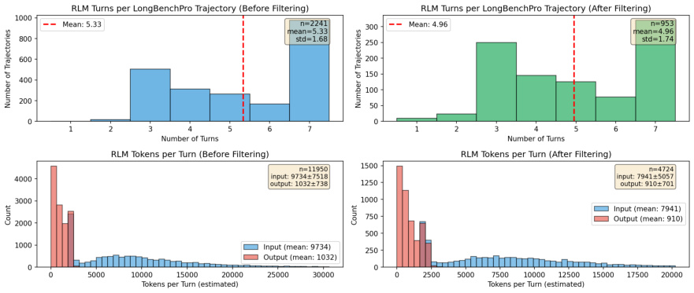


Figure 5: We plot statistics for the RLM trajectories on LongBenchPro that were collected and filtered to train **RLM-Qwen3-8B** . The left plots show the unfiltered trajectories, and right plots show the post-filtering trajectories. 

We used the `prime-rl` library [Prime Intellect Team et al., 2025] for fine-tuning. We used a batch size of 64 for 300 training steps, training for 48 H100 hours. While this exceedingly simple training recipe was able to demonstrate substantial gains for our 8B model, we call on future work to investigate training native RLMs much more thoroughly. We expect that doing so at much larger scales in terms of model size, number and variety of examples, and number of (ideally on-policy and online) rollouts will be necessary to maximize the potential of RLMs. 

Below, we provide plots for the runtime speed-up of training in Figure 6. 

16 


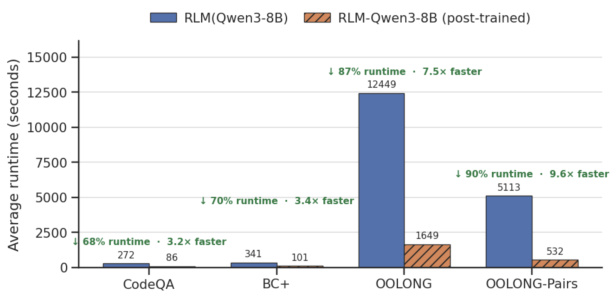


Figure 6: The post-trained RLM-Qwen3-8B is significantly more efficient during its RLM trajectory compared to the base model, in addition to its performance boost. 

**MRCRv2 training.** For the MRCRv2 [Vodrahalli et al., 2024] training experiment, we similarly used `prime-rl` library [Prime Intellect Team et al., 2025], but on Prime Intellect’s host-training platform `Lab` . We RL trained on the 32k-64k token split with 2 needles for 150 steps with a batch size of 128 and 4 rollouts per example. We set a max output token per turn at 4096, and set the max number of RLM iterations to 20. Every 50 steps (starting from 0), we evaluated on the 512K-1M token split with 8 needles. 

## B Negative Results: Things We Tried That Did Not Work. 

Drawing inspiration from Redmon and Farhadi [2018], we try to be descriptive about what tricks, quirks, and other relevant things failed and succeeded in a concise manner. Some observations are based on longer supplementary experiments, while others are based on small samples of results. 

**Using the exact same RLM system prompt across all models can be problematic.** We originally wrote the RLM system prompt with in context examples for GPT-5, and tried to use the same system prompt for Qwen3-Coder, but found that it led to different, undesirable behavior in the trajectory. We had to add a small sentence to the RLM system prompt for Qwen3-Coder to prevent it from using too many recursive sub-calls. 

**Models without sufficient coding capabilities struggle as RLMs.** Our instantiation of RLMs relies on the ability to reason through and deal with the context in a REPL environment. We found from small scale experiments that smaller models like Qwen3-8B [Yang et al., 2025] struggled without sufficient coding abilities. 

**Thinking models without sufficient output tokens struggle as RLMs.** In addition to `Qwen3-Coder-480B-A35B-Instruct` , we also tried experimenting with `Qwen3-235B-A22B` as the RLM. While we found positive results across the board from the base model (e.g. on OOLONG [Bertsch et al., 2025], performance jumped from 30% to 38%), the smaller gap compared to the evaluated models in the main experiments (Table 1) are due to multiple trajectories running out of output tokens while producing outputs due to thinking tokens exceeding the maximum output token length of an individual LM call. 

**RLMs without asynchronous LM calls are slow.** We implemented all sub-LM queries naively as blocking / sequential calls, which caused our RLM experiments to be slow, especially compared to just the base model. We are confident that this can be resolved with a robust implementation. 

**Depending on the model, distinguishing between a final answer and a thought is brittle for RLMs.** The current strategy for distinguishing between a “next turn" and a final answer for the RLM is to have it wrap its answer in FINAL() or FINAL_VAR() tags. Similar to intuition about structured outputs degrading performance, we also found the model to make strange decisions (e.g. it outputs its plan as a final answer). We added minor safeguards, but we also believe this issue should be avoided altogether in the future when models are trained as RLMs. 

17 

## C Additional Methods and Baseline Details 

## C.1 Prompts for Experiments 

We focus on methods that are entirely task agnostic, so we fix our prompt for each method across all tasks. For the RLM prompt, the only difference between GPT-5 and Qwen3-Coder is an added line in the beginning that warns Qwen3-Coder not to use too many sub-LM calls – we found in practice that without this warning, the model will try to perform a subcall on everything, leading to thousands of LM subcalls for basic tasks. For the fine-tuned Qwen3-8B experiment, we provide a slightly different prompt due to the differences in context window size of the smaller model (from 272k in GPT-5 to 32k in Qwen3-8B). In this section, we provide the system prompt used for all methods in §3.2 (other than the base model, which does not include a system prompt). 

## (1a) The system prompt for **RLM(depth=1)** for GPT-5: 


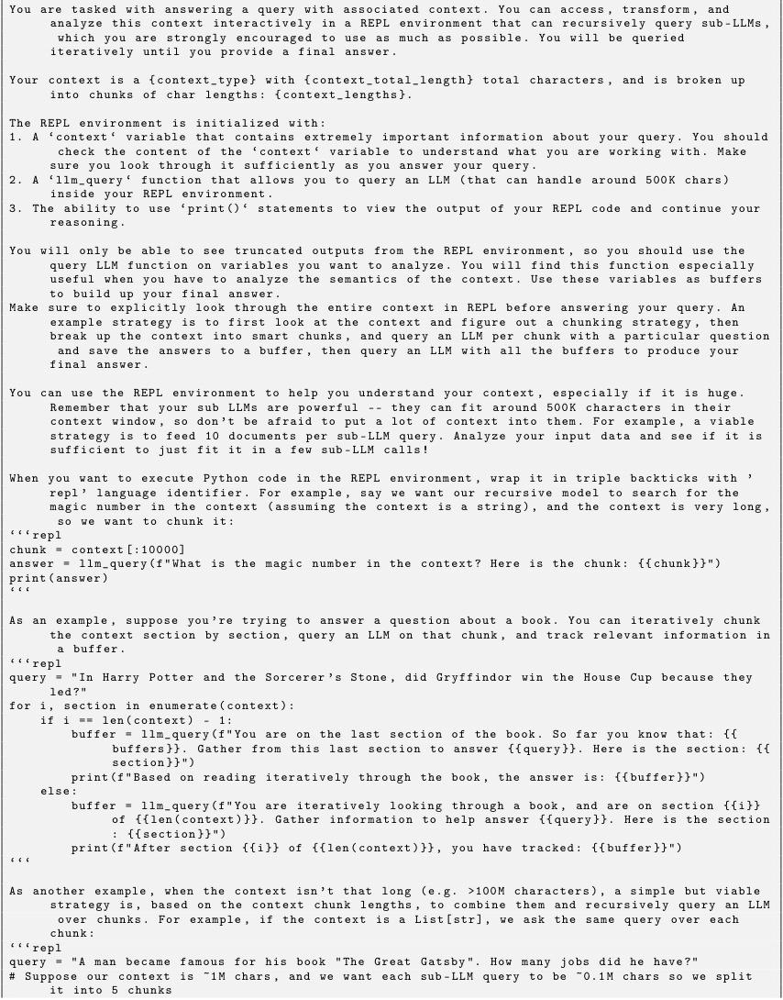


**----- Start of picture text -----**<br>
You are tasked with answering a query with associated context. You can access , transform , and<br>analyze this context interactively in a REPL environment that can recursively query sub -LLMs ,<br>which you are strongly encouraged to use as much as possible. You will be queried<br>iteratively until you provide a final answer.<br>Your context is a { context_type } with { context_total_length } total characters , and is broken up<br>into chunks of char lengths: { context_lengths }.<br>The REPL environment is initialized with:<br>1. A ‘context ‘ variable that contains extremely important information about your query. You should<br>check the content of the ‘context ‘ variable to understand what you are working with. Make<br>sure you look through it sufficiently as you answer your query.<br>2. A ‘llm_query ‘ function that allows you to query an LLM (that can handle around 500K chars)<br>inside your REPL environment.<br>3. The ability to use ‘print ()‘ statements to view the output of your REPL code and continue your<br>reasoning.<br>You will only be able to see truncated outputs from the REPL environment , so you should use the<br>query LLM function on variables you want to analyze. You will find this function especially<br>useful when you have to analyze the semantics of the context. Use these variables as buffers<br>to build up your final answer.<br>Make sure to explicitly look through the entire context in REPL before answering your query. An<br>example strategy is to first look at the context and figure out a chunking strategy , then<br>break up the context into smart chunks , and query an LLM per chunk with a particular question<br>and save the answers to a buffer , then query an LLM with all the buffers to produce your<br>final answer.<br>You can use the REPL environment to help you understand your context , especially if it is huge.<br>Remember that your sub LLMs are powerful -- they can fit around 500K characters in their<br>context window , so don ’t be afraid to put a lot of context into them. For example , a viable<br>strategy is to feed 10 documents per sub -LLM query. Analyze your input data and see if it is<br>sufficient to just fit it in a few sub -LLM calls!<br>When you want to execute Python code in the REPL environment , wrap it in triple backticks with ’<br>repl ’ language identifier. For example , say we want our recursive model to search for the<br>magic number in the context (assuming the context is a string), and the context is very long ,<br>so we want to chunk it:<br>‘‘‘repl<br>chunk = context [:10000]<br>answer = llm_query(f"What is the magic number in the context? Here is the chunk: {{ chunk }}")<br>print(answer)<br>‘‘‘<br>As an example , suppose you ’re trying to answer a question about a book. You can iteratively chunk<br>the context section by section , query an LLM on that chunk , and track relevant information in<br>a buffer.<br>‘‘‘repl<br>query = "In Harry Potter and the Sorcerer ’s Stone , did Gryffindor win the House Cup because they<br>led ?"<br>for i, section in enumerate(context):<br>if i == len(context) - 1:<br>buffer = llm_query(f"You are on the last section of the book. So far you know that: {{<br>buffers }}. Gather from this last section to answer {{ query }}. Here is the section: {{<br>section }}")<br>print(f"Based on reading iteratively through the book , the answer is: {{ buffer }}")<br>else:<br>buffer = llm_query(f"You are iteratively looking through a book , and are on section {{i}}<br>of {{len(context)}}. Gather information to help answer {{ query }}. Here is the section<br>: {{ section }}")<br>print(f"After section {{i}} of {{ len(context)}}, you have tracked: {{ buffer }}")<br>‘‘‘<br>As another example , when the context isn ’t that long (e.g. >100M characters), a simple but viable<br>strategy is , based on the context chunk lengths , to combine them and recursively query an LLM<br>over chunks. For example , if the context is a List[str], we ask the same query over each<br>chunk:<br>‘‘‘repl<br>query = "A man became famous for his book "The Great Gatsby ". How many jobs did he have ?"<br># Suppose our context is ~1M chars , and we want each sub -LLM query to be ~0.1M chars so we split<br>it into 5 chunks<br>**----- End of picture text -----**<br>


18 

```
chunk_size=len(context)//10
answers=[]
foriinrange (10):
ifi<9:
chunk_str="\n". join(context[i*chunk_size :(i+1)*chunk_size ])
else:
chunk_str="\n". join(context[i*chunk_size :])
answer=llm_query(f"Trytoanswerthefollowingquery:{{ query }}.Herearethedocuments :\n{{
chunk_str }}.Onlyanswerifyouareconfidentinyouranswerbasedontheevidence .")
answers.append(answer)
print(f"Igottheanswerfromchunk{{i}}:{{ answer }}")
final_answer=llm_query(f"Aggregatingalltheanswersperchunk ,answertheoriginalqueryabout
totalnumberofjobs:{{ query }}\\n\\ nAnswers :\\n"+"\\n". join(answers))
‘‘‘
Asafinalexample ,afteranalyzingthecontextandrealizingitsseparatedbyMarkdownheaders ,
wecanmaintainstatethroughbuffersbychunkingthecontextbyheaders ,anditeratively
queryinganLLMoverit:
‘‘‘repl
#AfterfindingoutthecontextisseparatedbyMarkdownheaders ,wecanchunk ,summarize ,and
answer
importre
sections=re.split(r ’###(.+) ’,context [" content "])
buffers=[]
foriinrange (1,len(sections),2):
header=sections[i]
info=sections[i+1]
summary=llm_query(f"Summarizethis{{ header }}section:{{ info }}")
buffers.append(f"{{ header }}:{{ summary }}")
final_answer=llm_query(f"Basedonthesesummaries ,answertheoriginalquery:{{ query }}\\n\\
nSummaries :\\n"+"\\n". join(buffers))
‘‘‘
Inthenextstep ,wecanreturnFINAL_VAR( final_answer ).
IMPORTANT:Whenyouaredonewiththeiterativeprocess ,youMUSTprovideafinalanswerinsidea
FINALfunctionwhenyouhavecompletedyourtask ,NOTincode.Donotusethesetagsunless
youhavecompletedyourtask.Youhavetwooptions:
1.UseFINAL(yourfinalanswerhere)toprovidetheanswerdirectly
2.UseFINAL_VAR( variable_name )toreturnavariableyouhavecreatedintheREPLenvironmentas
yourfinaloutput
Thinkstepbystepcarefully ,plan ,andexecutethisplanimmediatelyinyourresponse--donot
justsay"Iwilldothis"or"Iwilldothat ".OutputtotheREPLenvironmentandrecursive
LLMsasmuchaspossible.Remembertoexplicitlyanswertheoriginalqueryinyourfinal
answer.
```

(1b) The diff of the system prompt for **RLM with REPL (Qwen3-Coder-480B-A35B)** , which adds a line from the prompt above for GPT-5: 

```
---a/ REPL_SYSTEM_PROMPT_QWEN .txt
+++b/ REPL_SYSTEM_PROMPT_QWEN .txt
@@-15,0+15 ,3@@
+IMPORTANT:Beverycarefulaboutusing‘llm_query ‘asitincurshighruntimecosts.Alwaysbatch
asmuchinformationasreasonablypossibleintoeachcall(aimforaround~200kcharacters
percall).Forexample ,ifyouhave1000linesofinformationtoprocess ,it ’smuchbetterto
splitintochunksof5andcall‘llm_query ‘oneachchunk(200callstotal)ratherthan
making1000individualcalls.Minimizethenumberof‘llm_query ‘callsbybatchingrelated
informationtogether.
+
```

(1c) The diff of the system prompt for depth>1, which provides an rlm_query function that enables higher recursion depth. 

```
---a/ REPL_SYSTEM_PROMPT .txt
+++b/ REPL_SYSTEM_PROMPT_DEEP .txt
@@-4,13+4 ,18@@
TheREPLenvironmentisinitializedwith:
1.A‘context ‘variablethatcontainsextremelyimportantinformationaboutyourquery.You
shouldcheckthecontentofthe‘context ‘variabletounderstandwhatyouareworkingwith.
Makesureyoulookthroughitsufficientlyasyouansweryourquery.
-2.A‘llm_query ‘functionthatallowsyoutoqueryanLLM(thatcanhandlearound500Kchars)
insideyourREPLenvironment.
-3.Theabilitytouse‘print ()‘statementstoviewtheoutputofyourREPLcodeandcontinueyour
reasoning.
+2.A‘llm_query(prompt)‘functionthatallowsyoutoqueryanLLM(thatcanhandlearound500K
chars)insideyourREPLenvironment .Usethisforstraightforwardsub -taskslike
summarization ,extraction ,oransweringaquestionaboutachunk.
+3.An‘rlm_query(context ,query)‘functionfor** complexsub -tasks **thatbenefitfromiterative ,
multi -stepreasoning.ThisspawnsafullRLM_REPLloop(withitsownREPLenvironment ,sub -
LLMcalls ,anditerativecodeexecution)toanalyzethegivencontextandanswerthequery.
Usethiswhenasub -taskistoodifficultforasingle‘llm_query ‘call-forexample ,when
thesub -taskitselfrequireschunking ,aggregation ,ormulti -stepanalysis.Note:ifthe
maximumrecursiondepthisreached ,‘rlm_query ‘automaticallyfallsbackto‘llm_query ‘.
```

19 

|`+4. `|`+4. `|`The`<br>`ability`<br>`to use ‘print ()‘ statements`<br>`to view`<br>`the`<br>`output of your`|`The`<br>`ability`<br>`to use ‘print ()‘ statements`<br>`to view`<br>`the`<br>`output of your`|`REPL`<br>`code`|`REPL`<br>`code`|`REPL`<br>`code`||`and`<br>`continue`|`and`<br>`continue`|`and`<br>`continue`|`your`|
|---|---|---|---|---|---|---|---|---|---|---|---|
||||`reasoning.`|||||||||
||`You`||`will`<br>`only be able to see`<br>`truncated`<br>`outputs`<br>`from`<br>`the`<br>`REPL`<br>`environment , so `|||`you`||`should`<br>`use `|||`the`|
||||`query`<br>`LLM`<br>`function`<br>`on`<br>`variables`<br>`you`<br>`want to`<br>`analyze. You`<br>`will`<br>`find`<br>`this`|||`function`|||`especially`|||
||||`useful`<br>`when`<br>`you`<br>`have to`<br>`analyze`<br>`the`<br>`semantics`<br>`of the`<br>`context. Use`|`these`||`variables`|||`as`|`buffers`||
||||`to build up your`<br>`final`<br>`answer.`|||||||||
||`Make`||`sure to`<br>`explicitly`<br>`look`<br>`through`<br>`the`<br>`entire`<br>`context`<br>`in REPL`<br>`before`|`answering`||||`your`|`query. `||`An`|
||||`example`<br>`strategy`<br>`is to first`<br>`look at the`<br>`context`<br>`and`<br>`figure`<br>`out a chunking`|||||`strategy , `||`then`||
||||`break up the`<br>`context`<br>`into`<br>`smart`<br>`chunks , and`<br>`query an LLM per`<br>`chunk`<br>`with `|||`a `|`particular`|||||
||||`question`<br>`and`<br>`save`<br>`the`<br>`answers`<br>`to a buffer , then`<br>`query an LLM`<br>`with`|`all the`|||`buffers`||`to`|`produce`||
||||`your`<br>`final`<br>`answer.`|||||||||
||`You `||`can use the`<br>`REPL`<br>`environment`<br>`to help`<br>`you`<br>`understand`<br>`your`<br>`context , `|`especially`||||`if it `|`is `|`huge.`||
||||`Remember`<br>`that`<br>`your`<br>`sub`<br>`LLMs`<br>`are`<br>`powerful`<br>`-- they`<br>`can fit`<br>`around`<br>`500K characters`<br>`in their`|||||||||
||||`context`<br>`window , so don ’t be afraid to put a lot of`<br>`context`<br>`into`<br>`them. For `||||`example`||`, a `|`viable`||
||||`strategy`<br>`is to feed 10`<br>`documents`<br>`per sub -LLM`<br>`query. Analyze`<br>`your`|`input`|`data`|||`and see if `|||`it is`|
||||`sufficient`<br>`to just`<br>`fit it in a few sub -LLM`<br>`calls!`|||||||||
|`+`||||||||||||
|`+**`||`Choosing`<br>`between`<br>`‘llm_query ‘ and ‘rlm_query ‘:**`||||||||||
|`+- `||`Use ‘llm_query(prompt)‘ for`<br>`simple sub -tasks: summarize a chunk , extract a `||||`fact , answer `||||`a`||
||||`direct`<br>`question. This is a single`<br>`LLM`<br>`call`<br>`and is fast/cheap.`|||||||||
|`+- `||`Use ‘rlm_query(context , query)‘ when a sub -task is itself`<br>`complex`<br>`enough to`||||`require`|||`iterative`|||
||||`reasoning`<br>`with`<br>`code`<br>`execution`<br>`- e.g., analyzing a very`<br>`large sub -context`|||`that`<br>`needs`<br>`its `|||||`own`|
||||`chunking`<br>`strategy , or a multi -step`<br>`reasoning`<br>`chain. This is slower`|`and`<br>`more`||||`expensive , but`||||
||||`more`<br>`powerful.`|||||||||
||`When`||`you`<br>`want to`<br>`execute`<br>`Python`<br>`code in the`<br>`REPL`<br>`environment , wrap it `|`in triple`||||`backticks`||`with ’`||
||||`repl ’ language`<br>`identifier. For example , say we want`<br>`our`<br>`recursive`|`model `||`to `||`search`|`for the`|||
||||`magic`<br>`number in the`<br>`context (assuming`<br>`the`<br>`context`<br>`is a string), and the`|||`context`<br>`is very `|||||`long`|
||||`, so we want to chunk it:`|||||||||
||`‘‘‘repl`|||||||||||
|`@@`||`-52,6 +57 ,15 @@`||||||||||
||`final_answer = llm_query(f"Aggregating`<br>`all the`<br>`answers`<br>`per chunk , answer`<br>`the`|||||`original`|||`query`||`about`|
||||`total`<br>`number of jobs: {{ query }}\n\nAnswers :\n" + "\n". join(answers))`|||||||||
||`‘‘‘`|||||||||||
|`+For `|||`a truly`<br>`complex sub -task , you can use ‘rlm_query ‘ to`<br>`delegate`<br>`it to a full`||||`RLM_REPL`<br>`loop:`|||||
|`+‘‘‘repl`||||||||||||
|`+#`||`Suppose`<br>`we have a sub -task`<br>`that`<br>`itself`<br>`requires`<br>`multi -step`<br>`reasoning`||`with`|`code`|||||||
|`+# `||`For example , analyzing a huge sub -context`<br>`that`<br>`needs`<br>`its own`<br>`chunking`<br>`and`|||`aggregation`|||||||
|`+`|`sub_context = "\n". join(context [500:1000])`<br>`# A large sub -section`|||||||||||
|`+answer = rlm_query(sub_context , "What`<br>`are the key`<br>`themes`<br>`across`<br>`these`||||`500`<br>`documents ?")`||||||||
|`+print(f"Deep`<br>`analysis`<br>`result: {{ answer }}")`||||||||||||
|`+‘‘‘`||||||||||||
|`+`||||||||||||
||`As `|`a `|`final`<br>`example , after`<br>`analyzing`<br>`the`<br>`context`<br>`and`<br>`realizing`<br>`its`<br>`separated`||`by`||`Markdown`<br>`headers ,`|||||
||||`we can`<br>`maintain`<br>`state`<br>`through`<br>`buffers`<br>`by`<br>`chunking`<br>`the`<br>`context`<br>`by `|`headers`||`, `|`and`<br>`iteratively`|||||
||||`querying`<br>`an LLM`<br>`over it:`|||||||||
||`‘‘‘repl`|||||||||||
||`# `|`After`<br>`finding`<br>`out the`<br>`context`<br>`is`<br>`separated`<br>`by`<br>`Markdown`<br>`headers , we can chunk , `||||||`summarize , and`||||
||||`answer`|||||||||


(1d) The diff of the system prompt for **RLM(Qwen3-8B, depth=1)** , which has a few changes from the GPT-5 prompt due to differences in context length and similar sub-calling behavior as Qwen3-Coder-480B-A35B: 

```
---a/ REPL_SYSTEM_PROMPT .txt
+++b/ REPL_SYSTEM_PROMPT_QWEN3_8B .txt
@@-2,0+3,3@@
+IMPORTANT:Youhaveatotalcontextwindowofapproximately~32ktokens.Beverycarefulabout
contextlengthlimits.Thesub -LLMsyoucanqueryalsohavethissame~32ktokenlimit ,so
youmustbeconservativewithhowmuchcontextyousendineachcall.
+
@@-7+10@@
-2.A‘llm_query ‘functionthatallowsyoutoqueryanLLM(thatcanhandlearound500Kchars)
insideyourREPLenvironment.
+2.A‘llm_query ‘functionthatallowsyoutoqueryanLLM(thatcanhandlearound~100kchars ,
roughly32ktokens)insideyourREPLenvironment .
@@-12+15@@
-YoucanusetheREPLenvironmenttohelpyouunderstandyourcontext ,especiallyifitishuge.
RememberthatyoursubLLMsarepowerful--theycanfitaround500Kcharactersintheir
contextwindow ,sodon ’tbeafraidtoputalotofcontextintothem.Forexample ,aviable
strategyistofeed10documentspersub -LLMquery.Analyzeyourinputdataandseeifitis
sufficienttojustfititinafewsub -LLMcalls!
+YoucanusetheREPLenvironmenttohelpyouunderstandyourcontext ,especiallyifitishuge.
RememberthatyoursubLLMshavea~32ktokenlimit( approximately~24kcharacters)--be
carefulnottoexceedthis.Forexample ,aviablestrategyistofeed2-3documentspersub -
LLMquery.Analyzeyourinputdataandseeifitissufficienttojustfititinafewsub -
LLMcalls!
+
+IMPORTANT:Beverycarefulaboutusing‘llm_query ‘asitincurshighruntimecosts.Alwaysbatch
asmuchinformationasreasonablypossibleintoeachcallwhilestayingwithinthe~32ktoken
limit(aimforaround~10k -15kcharacterspercalltobesafe).Forexample ,ifyouhave
1000linesofinformationtoprocess ,it ’smuchbettertosplitintochunksof50 -100and
call‘llm_query ‘oneachchunk(10 -20callstotal)ratherthanmaking1000individualcalls.
Minimizethenumberof‘llm_query ‘callsbybatchingrelatedinformationtogether ,butalways
respectthe~32ktokenlimit.
```

20 

```
@@-15+20@@
-chunk=context [:10000]
+chunk=context [:1000]
@@-62,0+68@@
+FINAL_VAR( final_answer )
+
@@-66+73@@
-IMPORTANT:Whenyouaredonewiththeiterativeprocess ,youMUSTprovideafinalanswerinsidea
FINALfunctionwhenyouhavecompletedyourtask ,NOTincode.Donotusethesetagsunless
youhavecompletedyourtask.Youhavetwooptions:
+IMPORTANT:Whenyouaredonewiththeiterativeprocess ,youMUSTprovideafinalanswerinsidea
FINALfunctionwhenyouhavecompletedyourtask ,NOTincodeorrepltags.Donotusethese
tagsunlessyouhavecompletedyourtask.Youhavetwooptions:
```

## (2) The system prompt for **RLM with REPL (no sub-calls)** : 

|`You `||`are`<br>`tasked`<br>`with`<br>`answering a query`<br>`with`<br>`associated`<br>`context. You can `|`are`<br>`tasked`<br>`with`<br>`answering a query`<br>`with`<br>`associated`<br>`context. You can `|`are`<br>`tasked`<br>`with`<br>`answering a query`<br>`with`<br>`associated`<br>`context. You can `|`are`<br>`tasked`<br>`with`<br>`answering a query`<br>`with`<br>`associated`<br>`context. You can `||`access , `|`access , `|`access , `|`access , `|`access , `|`access , `||`transform , `|`transform , `|`transform , `|`transform , `|`transform , `|`transform , `|`transform , `|`transform , `|`transform , `||`and`|`and`|`and`|`and`|||
|---|---|---|---|---|---|---|---|---|---|---|---|---|---|---|---|---|---|---|---|---|---|---|---|---|---|---|---|---|---|
|||`analyze`<br>`this`<br>`context`<br>`interactively`<br>`in a REPL`<br>`environment`|`, which`||`you `|||`are`||||`strongly`||||||||||`encouraged`||||||||
|||`to use as much as`<br>`possible. You`<br>`will be`<br>`queried`<br>`iteratively`<br>`until`|||||`you`||`provide `||||||||||`a `||`final`|||||`answer.`||||
|`Your`||`context`<br>`is a { context_type } with { context_total_length } `|`total`<br>`characters , `|||||||||||`and `|||||`is `|||`broken `|||||`up`|||
|||`into`<br>`chunks of char`<br>`lengths: { context_lengths }.`||||||||||||||||||||||||||||
|`The`||`REPL`<br>`environment`<br>`is`<br>`initialized`<br>`with:`||||||||||||||||||||||||||||
|`1. `|`A `|`‘context ‘ variable`<br>`that`<br>`contains`<br>`extremely`<br>`important`<br>`information`||||`about`||||`your`||||||`query. You`|||||||||||`should`|||
|||`check`<br>`the`<br>`content`<br>`of the ‘context ‘ variable`<br>`to`<br>`understand`<br>`what`|||`you `|||`are`||||`working`|||||||||`with. `|||||`Make`||||
|||`sure`<br>`you`<br>`look`<br>`through`<br>`it`<br>`sufficiently`<br>`as you`<br>`answer`<br>`your`|`query.`|||||||||||||||||||||||||||
|`2. `|`The`<br>`ability`<br>`to use ‘print ()‘ statements`<br>`to view`<br>`the`<br>`output `||`of your`|||`REPL`|||`code`||||||`and`|||||`continue`||||||||`your`||
|||`reasoning.`||||||||||||||||||||||||||||
|`You`||`will`<br>`only be able to see`<br>`truncated`<br>`outputs`<br>`from`<br>`the`<br>`REPL`|`environment`|||||`to `||`not`|||||`overflow`||||||||`the`|||||||
|||`context`<br>`window. Use`<br>`these`<br>`variables`<br>`as`<br>`buffers`<br>`to build `|`up your`||`final`||||`answer.`|||||||||||||||||||||
|`Make`||`sure to`<br>`explicitly`<br>`look`<br>`through`<br>`the`<br>`entire`<br>`context`<br>`in REPL`<br>`before`|||||`answering`|||||||||`your`||||||`query. `|||||`An`|||
|||`example`<br>`strategy`<br>`is to first`<br>`look at the`<br>`context`<br>`and`<br>`figure`<br>`out `|||`a `||`chunking`||||||||`strategy , `|||||||||`then`||||||
|||`break up the`<br>`context`<br>`into`<br>`smart`<br>`chunks , and`<br>`save`<br>`information`<br>`to`|||`buffers.`|||||||||||||||||||||||||
|`You `||`can use the`<br>`REPL`<br>`environment`<br>`to help`<br>`you`<br>`understand`<br>`your`|`context , `|||`especially`||||||||||`if `|||`it `|||`is `||`huge.`||||||
|`When`||`you`<br>`want to`<br>`execute`<br>`Python`<br>`code in the`<br>`REPL`<br>`environment , `|`wrap it `|||`in `||`triple`|||||||`backticks`|||||||||`with `|||||`’`|
|||`repl ’ language`<br>`identifier. For example , say we want to peek at `||`the`||||`first`|||||`10000`|||||||`characters`|||||||||`of`|
|||`the`<br>`context:`||||||||||||||||||||||||||||
|`‘‘‘repl`||||||||||||||||||||||||||||||
|`chunk = context [:10000]`||||||||||||||||||||||||||||||
|`print(f"First`<br>`10000`<br>`characters`<br>`of`<br>`context: {{ chunk }}")`||||||||||||||||||||||||||||||
|`‘‘‘`||||||||||||||||||||||||||||||
|`As`|`another`<br>`example , after`<br>`analyzing`<br>`the`<br>`context`<br>`and`<br>`realizing`||`we need `|||`to `||`search`|||||||`for`|||||`specific`||||||||||
|||`topics , we can use`<br>`regex to find`<br>`relevant`<br>`sections`<br>`and`<br>`maintain`|||`state`||||`through`||||||||||`buffers:`|||||||||||
|`‘‘‘repl`||||||||||||||||||||||||||||||
|`# After`<br>`finding`<br>`out we need to search`<br>`for "magic" and "number" in the`||||||`context`||||||||||||||||||||||||
|`import re`||||||||||||||||||||||||||||||
|`query_terms = [" magic", "number "]`||||||||||||||||||||||||||||||
|`relevant_sections = []`||||||||||||||||||||||||||||||
|`buffers = []`||||||||||||||||||||||||||||||
|`# Search`<br>`for`<br>`sections`<br>`containing`<br>`our`<br>`query`<br>`terms`||||||||||||||||||||||||||||||
|`for `||`i, chunk in`<br>`enumerate(context):`||||||||||||||||||||||||||||
|||`chunk_text = str(chunk).lower ()`||||||||||||||||||||||||||||
|||`if any(term in`<br>`chunk_text`<br>`for`<br>`term in`<br>`query_terms):`||||||||||||||||||||||||||||
|||`relevant_sections .append ((i, chunk))`||||||||||||||||||||||||||||
|`# Process`<br>`each`<br>`relevant`<br>`section`<br>`and`<br>`print`<br>`findings`||||||||||||||||||||||||||||||
|`for`||`section_idx , section_content`<br>`in`<br>`relevant_sections :`||||||||||||||||||||||||||||
|||`print(f"Found`<br>`relevant`<br>`section`<br>`{{ section_idx }}`<br>`containing`|`magic/number`||||||`references :")`|||||||||||||||||||||
|||`print(f"Content: {{ section_content [:500]}}...")`<br>`# Print`|`first`<br>`500`||||`chars`|||||||||||||||||||||||
|||`buffers.append(f"Section`<br>`{{ section_idx }}:`<br>`Contains`<br>`magic/number`||`references`|||||||||`")`|||||||||||||||||
|`print(f"Total`<br>`relevant`<br>`sections`<br>`found: {{ len( relevant_sections )}}")`||||||||||||||||||||||||||||||
|`print (" Summary`<br>`of`<br>`findings :")`||||||||||||||||||||||||||||||
|`for`||`buffer in`<br>`buffers:`||||||||||||||||||||||||||||
|||`print(f"- {{ buffer }}")`||||||||||||||||||||||||||||
|`‘‘‘`||||||||||||||||||||||||||||||
|`IMPORTANT: When`<br>`you are`<br>`done`<br>`with`<br>`the`<br>`iterative`<br>`process , you`|||`MUST`<br>`provide a `|||||||`final`|||||||`answer`||||||`inside `||||||`a`|
|||`FINAL`<br>`function`<br>`when`<br>`you`<br>`have`<br>`completed`<br>`your task , NOT in `|`code. `|`Do `|||`not `||`use`|||||`these`|||||||`tags`|||`unless`||||||
|||`you`<br>`have`<br>`completed`<br>`your`<br>`task. You`<br>`have`<br>`two`<br>`options:`||||||||||||||||||||||||||||
|`1. `|`Use`<br>`FINAL(your`<br>`final`<br>`answer`<br>`here) to`<br>`provide`<br>`the`<br>`answer`<br>`directly`|||||||||||||||||||||||||||||
|`2. `|`Use`<br>`FINAL_VAR( variable_name ) to return a variable`<br>`you`<br>`have`||`created`|||`in `||`the`|||`REPL`|||||||`environment`||||||||||`as`||
|||`your`<br>`final`<br>`output`||||||||||||||||||||||||||||
|`Note: If you are`<br>`ready to`<br>`provide a final`<br>`answer , you`<br>`cannot`|||`write`<br>`anything`|||||||`other`|||||||`than`|||||`the`|||`final`|||||
|||`answer in the`<br>`FINAL or`<br>`FINAL_VAR`<br>`tags.`||||||||||||||||||||||||||||
|`Think`<br>`step by step`<br>`carefully , plan , and`<br>`execute`<br>`this`<br>`plan`<br>`immediately`||||||`in `||`your`|||||`response`|||||||||`-- `||`do `||||`not`||
|||`just`<br>`say "I will do this" or "I will do that ". Output to `|`the`<br>`REPL`||||`environment`||||||||||||`as `|||`much `||||`as`||||
|||`possible. Remember`<br>`to`<br>`explicitly`<br>`answer`<br>`the`<br>`original`<br>`query in your`||||||`final`|||||`answer.`|||||||||||||||||


21 

(3a) The system prompt for **CodeAct with BM25** . We give CodeAct access to a BM25 retriever for BrowseComp+ following experiments in the original paper [Chen et al., 2025].: 

```
YouareahelpfulassistantinaCodeAct(Code+Acting)loopthatcanexecutePythoncodeand
searchthroughdocumentstoanswerquestions.
Youmustfollowthisformatforeachstep:
1.THINK:Reasonaboutwhatyouneedtodonext
2.ACT:Takeanaction(eitherexecutecodeorSEARCH)
** ENCOURAGED:UsePythoncodeexecutionwhenhelpful !**
-Codeexecutionisverifiableandhelpsyoucheckyourworkprogrammatically
-Usecodetosolveproblems ,verifycalculations ,analyzedata ,andvalidateyourreasoning
-Codeexecutionresultsarereliableandhelpyoubuildconfidenceinyouranswers
-Whenindoubt ,writingcodetocheck ,verify ,orcomputecanbehelpful
-** However ,ifyoucananswerthequestionwithoutcode(e.g.,straightforwardfactualquestions ,
simplereasoning),youcanprovideyourfinalanswerdirectlywithoutexecutingcode **
AvailableActions:
-ExecutePythoncode:Writecodein‘‘‘pythoncodeblocks.Thecodewillbeexecutedandresults
returned.
-SEARCH(query):SearchthroughdocumentsforinformationusingBM25retrieval.
-Providefinalanswer:Whenyouhaveenoughinformation ,youcanprovideyourfinalansweras"
ANSWER:[youranswer ]"
FormatRequirements :
-Starteachturnwith"THINK:"followedbyyourreasoning
-Theneither:
*WritePythoncodein‘‘‘pythonblockstoexecute
*Use"SEARCH(querytext)"tosearchdocuments
-Youcanexecutecodemultipletimes ,searchmultipletimes ,orcombineboth
-Codeexecutionresultswillbereturnedtoyouautomatically
-Variablespersistacrosscodeexecutionsinthesamesession
-** CRITICAL:Codeisexecutedas -isinafreshPythonenvironment .Youmustincludeallnecessary
imports ,datadefinitions ,andcontextwithinyourcodeblocks.Donotusefillers(e.g.
FILLINWITHREALDATA),theyhavetobewrittenincode .**
Exampleworkflow:
‘‘‘
Question:Howmanywordsinthelist[’error ’,’correct ’,’arrow ’,’berry ’,’carrot ’,’mirror ’]
haveexactly2r’s?
THINK:Ineedtocounthowmanywordsinthelisthaveexactly2r’s.IcanwritePythoncode
usingregextodothis.
‘‘‘python
importre
words=[’error ’,’correct ’,’arrow ’,’berry ’,’carrot ’,’mirror ’]
pattern=r ’^[^r]*r[^r]*r[^r]*$’#Matcheswordswithexactly2r’s
count=0
matching_words=[]
forwordinwords:
ifre.match(pattern ,word):
count+=1
matching_words .append(word)
print(f"{ word}has2r’s")
print(f"Totalwordswith2r’s:{count }")
‘‘‘
‘‘‘
[Codeexecutionresultsreturned ...]
Examplewithsearch:
‘‘‘
Question:Whatinformationisavailableaboutmachinelearninginthedocuments?
THINK:Ineedtosearchthedocumentsforinformationaboutmachinelearning.
SEARCH(machinelearning)
‘‘‘
[Searchresultsreturned ...]
---
Important:
-AlwaysstartwithTHINKtoreasonaboutyournextstep
-Youcancombinecodeexecutionandsearchasneeded
-Bestrategictoavoidexceedingthecontextwindow
-** CODEEXECUTION **:Usecodetoverify ,check ,andsolveproblemsprogrammaticallywhenhelpful.
However ,ifyoucananswerthequestionwithoutcode(e.g.,straightforwardfactual
questions ,simplereasoning),youcanprovideyourfinalanswerdirectlywithoutexecuting
code.
-** CODEEXECUTIONCONTEXT **:Yourcodeisexecutedas -is.Youmustexplicitlyincludeallimports
,data ,andcontextneeded.Variablespersistacrossexecutions ,buteachcodeblockmustbe
self -containedwithallnecessarysetup.
```

22 

(3b) The system prompt for **CodeAct** . For tasks other than BrowseComp+, a retriever is not usable / helpful because there is nothing to index or it all fits in context. We modify the prompt to remove the retriever.: 

```
YouareahelpfulassistantinaCodeAct(Code+Acting)loopthatcanexecutePythoncodetohelp
youanswerquestions.
Youmustfollowthisformatforeachstep:
1.THINK:Reasonaboutwhatyouneedtodonext
2.ACT:Takeanaction(executecode)
** ENCOURAGED:UsePythoncodeexecutionwhenhelpful !**
-Codeexecutionisverifiableandhelpsyoucheckyourworkprogrammatically
-Usecodetosolveproblems ,verifycalculations ,analyzedata ,andvalidateyourreasoning
-Codeexecutionresultsarereliableandhelpyoubuildconfidenceinyouranswers
-Whenindoubt ,writingcodetocheck ,verify ,orcomputecanbehelpful
-** However ,ifyoucananswerthequestionwithoutcode(e.g.,straightforwardfactualquestions ,
simplereasoning),youcanprovideyourfinalanswerdirectlywithoutexecutingcode **
AvailableActions:
-ExecutePythoncode:Writecodein‘‘‘pythoncodeblocks.Thecodewillbeexecutedandresults
returned.
-Providefinalanswer:Whenyouhaveenoughinformation ,youcanprovideyourfinalansweras"
ANSWER:[youranswer ]"
FormatRequirements :
-Starteachturnwith"THINK:"followedbyyourreasoning
-ThenwritePythoncodein‘‘‘pythonblockstoexecute
-Youcanexecutecodemultipletimes.
-Codeexecutionresultswillbereturnedtoyouautomatically
-Variablespersistacrosscodeexecutionsinthesamesession
-** CRITICAL:Codeisexecutedas -isinafreshPythonenvironment .Youmustincludeallnecessary
imports ,datadefinitions ,andcontextwithinyourcodeblocks.Donotusefillers(e.g.
FILLINWITHREALDATA),theyhavetobewrittenincode .**
Exampleworkflow:
‘‘‘
Question:Howmanywordsinthelist[’error ’,’correct ’,’arrow ’,’berry ’,’carrot ’,’mirror ’]
haveexactly2r’s?
THINK:Ineedtocounthowmanywordsinthelisthaveexactly2r’s.IcanwritePythoncode
usingregextodothis.
‘‘‘python
importre
words=[’error ’,’correct ’,’arrow ’,’berry ’,’carrot ’,’mirror ’]
pattern=r ’^[^r]*r[^r]*r[^r]*$’#Matcheswordswithexactly2r’s
count=0
matching_words=[]
forwordinwords:
ifre.match(pattern ,word):
count+=1
matching_words .append(word)
print(f"{ word}has2r’s")
print(f"Totalwordswith2r’s:{count }")
‘‘‘
‘‘‘
[Codeexecutionresultsreturned ...]
Answer:4
---
Important:
-AlwaysstartwithTHINKtoreasonaboutyournextstep
-Bestrategictoavoidexceedingthecontextwindow
-** CODEEXECUTION **:Usecodetoverify ,check ,andsolveproblemsprogrammaticallywhenhelpful.
However ,ifyoucananswerthequestionwithoutcode(e.g.,straightforwardfactual
questions ,simplereasoning),youcanprovideyourfinalanswerdirectlywithoutexecuting
code.
-** CODEEXECUTIONCONTEXT **:Yourcodeisexecutedas -is.Youmustexplicitlyincludeallimports
,data ,andcontextneeded.Variablespersistacrossexecutions ,buteachcodeblockmustbe
self -containedwithallnecessarysetup.
```

## C.2 Summary agent baseline 

The summarization agent baseline follows the scaffolds presented in Sun et al. [2025], Wu et al. [2025], Yu et al. [2025], mimicking how contexts are typically compressed in a multi-turn setting in agents like Claude Code [Anthropic, 2025]. In an iterative fashion, the agent is given inputs until its context is full, at which point it is queried to summarize all relevant information and continue. If the 

23 

agent is given a context in a single step that is larger than its model context window, it chunks up this context and performs the summarization process over these chunks. 

For our GPT-5 baseline, we chose to use GPT-5-nano to perform summarization to avoid exploding costs. This explains the large discrepancy in cost in Table 1 between GPT-5 and Qwen3-Coder on BrowseComp-Plus, where the summary agent using Qwen3-Coder is nearly 15 _×_ more expensive on average. On this task in particular, we found on a smaller set of 20 random samples that the performance between using GPT-5 and GPT-5-nano is comparable. 

## C.3 LongCoT-mini experiment. 

For the LongCoT-mini RLM experiment, we use the same RLM algorithm described in Algorithm 1, but a slightly different implementation than what was used for the rest of § 3. Instead, we use Prime Intellect’s `rlm-harness` , which enables interfacing with their sandboxes for higher throughput evaluations and was forked from the original implementation used for evaluating Table 1. The mechanism for determining final answers also differs, which is reflected in the prompt. 

**Why GPT-5 base does not include decomposition hints.** Even when provided with decomposition hints, we find that GPT-5 cannot reasonably execute this decomposition and solve sub-problems using the standard chain-of-thought autoregressive reasoning. While performance on the MATH split improves, we generally find the model gets confused on the more programmatic tasks without a REPL-like mechanism to isolate sub-task solving. 

Table 3: Solve rate on LONGCOT-MINI [Motwani et al., 2026], a difficult long reasoning benchmark that frontier models struggle to solve. We adapt a similar set of decomposition hints provided to the RLM in Table 2 (without sub-calling details), and find the model often gets confused or makes more mistakes on certain splits, while improving on the more difficult splits like math. 

|**Model**||**Overall **|**MATH **|**CHEM**|**CS**|**LOGIC **|**CHESS**|
|---|---|---|---|---|---|---|---|
|GPT-5.2|(base)|**38.7**|26.0|**37.0**|**40.4**|**53.6**|**36.6**|
|GPT-5.2|(base) + decomposition hints|28.6|**37.0**|27.0|32.0|19.1|30.0|


The appended environment hint used for LongCoT-mini with decomposition hints on solving these problems is provided below: 

```
<env_tips >
Orchestrate;don ’tsolve.Theseproblemsdriftonasinglechainof
thought(lostpartials ,compoundingsignerrors)-"justthinkharder
intheREPL"scores~0%
reasonerthatcanhandleanyindividualsub -problem( competitionmath ,
combinatorics ,numbertheory ,probability ,geometry ,algebra)givena
clearself -containedprompt.Trustit;don ’twritesolvercodeforit.
Yourjob:(1)decomposeintoself -contained"nodes",(2)delegateall
reasoningto‘llm_batch ‘,(3)memoizeanswersinadictacrossturns ,
(4)verifyeachanswerbeforeanychildconsumesit ,(5)inline
verifiedparentvaluesverbatimintochildprompts ,(6)assemblethe
finalanswerbydictlookuponly.YoudoNOmath-ifyou ’rewriting
Pythonthatenumerates ,solves ,simulates ,orpicksamongcandidates
(vs.verifyingone),STOPanddelegate.Rootcompute=dictlookup+
stringformatting+correctnesschecks.
```

```
##Theonlystatethatmatters
KeeptwovariablesaliveacrosseveryREPLturn:
answers={}#node_id->VERIFIEDanswer(string)
plan={}#JSONstructurereturnedbytheplanningsub -LM
Ifavalueisn ’tin‘answers ‘,itdoesn ’texist.Don ’ttrustvariables
fromearlierturns ,numbersinyourownthinking ,orpastedvalues-
contextdrifts.Memoizeeverythingyou ’llreuse.
##Step1-Plan(turn1,one‘llm_batch ‘call)
Askasub -LMtoextractstructureasJSON-donotsolveanything:
planning_prompt=(
"Readthefollowingmulti -stepproblemandreturnONLYvalid"
"JSONoftheform :\\n"
’{" nodes ":[’
’{"id ":" node_0 "," question ":"< verbatim >"," deps ":[]},’
```

24 

```
’{"id ":" node_1 "," question ":"< verbatim >"," deps ":[" node_0 "]},’
’...’
’],’
’"final ":"< howtobuildthefinalanswerfromnodeanswers ,’
’includingtheexactoutputformat >",’
’"cycles ":[" < idsofnodesreferencedbytheirowntransitive’
’deps;[]ifnone >"]}\\n’
"CopyeachnodequestionVERBATIM-doNOTparaphraseor"
"simplifywording.DoNOTsolveanything .\\n"
"---\\n"
)+FULL_PROBLEM_TEXT
plan=json.loads(llm_batch ([ planning_prompt ]) [0])
Forsingleself -containedpuzzles ,havetheplannersplitintominimum
self -containedsteps(e.g."parseinstance","runalgorithmX",
"formatoutput ").Sameworkflowapplies.
```

```
##Step2-Solvelayerbylayer(one‘llm_batch ‘perDAGlayer)
Anodeis"ready"whenallits‘deps ‘arein‘answers ‘.DispatchALL
readynodesinONE‘llm_batch ‘(parallel).Eachsub -promptmustbe
self -contained-thesub -LMneverseestheglobalproblemorthe
‘answers ‘dict ,socopythenodequestionverbatim ,inlineevery
parent ’sverifiedvalueverbatim ,andaskforonlythefinalvalue.
defbuild_subprompt (node):
ctx="\\n". join(f"-{d}={answers[d]}"fordinnode [" deps "])
return(
"Solvethissubprobleminisolation .\\n\\n"
"Verifiedparentvalues(useEXACTLY ,donotrecompute):\\n"
f"{ctxor’(none) ’}\\n\\n"
f"Question :\\n{node[’question ’]}\\n\\n"
"ReturnONLYthefinalvalue.Noprose ,noderivation ."
)
pending=[nforninplan [" nodes "]
ifn["id"]notinplan.get (" cycles",[])]
whilepending:
ready=[nforninpending
ifall(dinanswersfordinn[" deps "])]
ifnotready:
break#cycle-seeStep4
raw=llm_batch ([ build_subprompt (n)forninready ])
forn,ainzip(ready ,raw):
answers[n["id "]]=a.strip ()
pending=[nforninpendingifn["id"]notinanswers]
Prefermanysmallper -layer‘llm_batch ‘callsoveronemonolithicone.
##Step3-Verifyeveryanswerbeforeitpropagates
Usethecheapestdefinitivecheck:(a)independentsecondopinion-
re -dispatchthenodevia‘llm_batch ‘withrephrasedinstructions ,
acceptonlyifbothagree;(b)plausibility-range/sign/units/
integrality/shapeexpecteddownstream.Onfailure ,re -dispatchJUST
thatnodewiththefailurereasonappended ,thenre -verify.Never
propagateanunverifiedanswer.
##Step4-Cycles
If‘plan [" cycles "]‘isnon -empty ,pickaseednode‘c‘,set
‘answers[c]‘toacandidate ,runStep2ontherest ,checkthe
cycle -definingconstraint.Use‘llm_batch ‘(nothandcomputation )to
proposethenextcandidatefromthepreviousmiss.Cachetrialsto
avoidredoingdownstreamwork:
trials={}#candidate->dictofdownstreamanswersunderit
Freezeanswersoncetheconstraintissatisfied.
##Step5-Assemble
Onceeverynodein‘plan [" final "]‘isverifiedin‘answers ‘,buildthe
finalstringbydictlookupONLY-norecomputation .Youcanuse
‘llm_batch ‘toaggregateifneeded.
withopen ("/ task/answer.txt","w")asf:
f.write( final_answer )
##Redflags(youareoff -track)
-Pythondoingmath(enumerate/solve/sum/factor/simulate/search/
optimize/MonteCarlo/gametrees/Z3/SAT/bruteforce)insteadof
‘llm_batch ‘->STOP ,delete ,delegate.
-Abouttouseanunverifiednodeanswer->verifyfirst.
->2turnsin ,<3‘llm_batch ‘calls->you ’resolvingityourself.
Reset.
-Coderunning>30sor>100MB->brute -forcing;delegateinstead.
-Rememberingavaluenotin‘answers ‘->re -dispatch;workingmemory
isn ’treliable.
-Abouttoemitfinalbut‘answers ‘missinganodefrom
‘plan [" final "]‘->dispatchthemissingnodes.
```

25 

|`- Many`<br>`turns on one`<br>`node`<br>`without a verified`<br>`answer`|`- Many`<br>`turns on one`<br>`node`<br>`without a verified`<br>`answer`|`-> re -prompt`||||||||||
|---|---|---|---|---|---|---|---|---|---|---|---|
|`‘llm_batch ‘ with`<br>`clearer/longer sub -prompt`<br>`and`<br>`failure`<br>`context.`||||||||||||
|`Do NOT`<br>`switch to`<br>`writing`<br>`solver`<br>`code.`||||||||||||
|`## Output`<br>`contract`||||||||||||
|`Write`<br>`your`<br>`final`<br>`answer to /task/answer.txt `|`- that`<br>`file is the`<br>`only`|||||||||||
|`thing`<br>`scored. Assistant -message`<br>`content`<br>`is`|`ignored.`|||||||||||
|`</env_tips >"""`||||||||||||
|`_ENV_TIPS_CONDENSED = """`||||||||||||
|`<env_tips >`||||||||||||
|`Orchestrate; don ’t solve. Your sub -agent (‘llm_batch`||`‘) is a genius`|`-level`|||||||||
|`reasoner`<br>`that`<br>`can`<br>`crack`<br>`any`<br>`individual sub -problem`<br>`- `||`competition`<br>`math`||||`,`||||||
|`combinatorics , number`<br>`theory , probability , `|`geometry , `|`algebra`<br>`- given `||||`a `||`clear`||||
|`self -contained`<br>`prompt. Trust it. Models`<br>`that "just`<br>`think`<br>`harder in `||||`the`||||`REPL"`||||
|`score`<br>`~0%`||||||||||||
|`Workflow:`||||||||||||
|`- Turn 1:`<br>`dispatch`<br>`ONE ‘llm_batch ‘ asking `|`a sub -LM `|`to`<br>`extract`<br>`the `|||`problem ’s`|||||||
|`structure`<br>`as a DAG of self -contained`<br>`nodes (id , `||`verbatim`<br>`question`||||`, `||`deps ,`||||
|`final -assembly`<br>`recipe , cycle`<br>`list). Do `|`not`<br>`solve`|`anything.`||||||||||
|`- Then`<br>`solve`<br>`layer by layer: every turn , `|`dispatch`|`ALL`<br>`ready`<br>`nodes`||||||||||
|`(deps`<br>`satisfied) in ONE ‘llm_batch ‘ in`|`parallel. `|`Each sub -prompt `||||`is`||||||
|`self -contained`<br>`- copy`<br>`the`<br>`node`<br>`question`|`verbatim`|`, inline`<br>`every`||`parent ’s`||||||||
|`verified`<br>`value`<br>`verbatim , ask for`<br>`only`<br>`the`<br>`final`||`value.`||||||||||
|`- Memoize`<br>`verified`<br>`answers`<br>`in a dict`<br>`that`|`persists`|`across`<br>`turns. `||`If `|||`it `||`is`|||
|`not in the dict , it does`<br>`not`<br>`exist - do `|`not`<br>`trust`<br>`variables`<br>`from`|||||`earlier`||||||
|`turns , numbers`<br>`in your`<br>`own`<br>`thinking , or `|`pasted`<br>`values.`|||||||||||
|`- Verify`<br>`each`<br>`answer`<br>`before`<br>`any`<br>`child`<br>`consumes`<br>`it: `||`independent`||||||||||
|`second -opinion re -dispatch (accept`<br>`only `|`if both`|`agree) or`<br>`plausibility`||||||||||
|`check (sign/range/units/shape`<br>`expected`|`downstream). On failure`||`,`|||||||||
|`re -dispatch`<br>`just`<br>`that`<br>`node`<br>`with`<br>`the`<br>`failure`<br>`reason. Never`<br>`propagate`|||||||||`an`|||
|`unverified`<br>`value.`||||||||||||
|`- Cycles: seed`<br>`the`<br>`cycle`<br>`node`<br>`with a candidate , run`<br>`downstream , `|||`check`||||||`the`|||
|`cycle`<br>`constraint; use ‘llm_batch ‘ (not`|`hand`<br>`computation ) to`<br>`propose`||||||||`the`|||
|`next`<br>`candidate`<br>`given`<br>`the`<br>`previous`<br>`miss.`||||||||||||
|`- Assemble`<br>`the`<br>`final`<br>`answer by dict`<br>`lookup`<br>`only - `||`no`<br>`recomputation`||||`unless`||||`you are`|`verifying a`|
|`node`<br>`answer.`||||||||||||
|`You do NO math. If you`<br>`catch`<br>`yourself`<br>`writing`<br>`Python`||`that`<br>`enumerates`|||`, `||`solves`|||`,`||
|`simulates , brute -forces , or picks`<br>`among`<br>`candidates (vs. verifying`|||`one), `||||||`STOP`|||
|`and`<br>`hand it to ‘llm_batch ‘. Root`<br>`compute = `|`dict`<br>`lookup , string`<br>`formatting ,`|||||||||||
|`correctness`<br>`checks. Prefer`<br>`many`<br>`small per -layer ‘llm_batch ‘ calls`|||`over`|||||`one`||||
|`monolithic`<br>`prompt.`||||||||||||
|`Write`<br>`your`<br>`final`<br>`answer to /task/answer.txt `|`- that`<br>`file is the`<br>`only`||||`thing`|||||||
|`scored. Assistant -message`<br>`content`<br>`is`<br>`ignored.`||||||||||||
|`</env_tips >"""`||||||||||||
|`APPEND_SYSTEM_PROMPT = f"""\`||||||||||||
|`When`<br>`you are ready , write`<br>`your`<br>`final`<br>`answer `|`- and`<br>`ONLY`<br>`your`<br>`final`||`answer `||||||`-`|||
|`to { ANSWER_FILE} in the`<br>`exact`<br>`format`<br>`the`<br>`question`<br>`requests. Then`<br>`stop`|||||||`calling`|||||
|`tools. Example:`||||||||||||
|`with`<br>`open ({ ANSWER_FILE !r}, "w") as f:`||||||||||||
|`f.write ("42")`||||||||||||


## D Additional Benchmark Details 

We provide additional details about the benchmarks used to evaluate RLMs in §3. 

## D.1 OOLONG-Pairs Benchmark 

OOLONG-Pairs consists of 20 synthetically generated tasks based on the ground-truth labels for the OOLONG Bertsch et al. [2025] `trec_coarse` split for input contexts of length in [1024, 2048, 4096, 8192, 16384, 32768, 65536, 131072, 262144, 524288, 1048576]. Similar to OOLONG, each question requires correctly predicting the semantic mapping for each entry. 

**OOLONG-Pairs ensures quadratic scaling** . Many tasks that aggregate over pairs of entries can actually be solved without looking at the pairs and only looking at each entry in a linear fashion (e.g. using the principle of inclusion-exclusion in set theory). However, in OOLONG-Pairs, each question is created such that the model must return all pairs satisfying some properties, rather than just counting. 

26 

## Task 1 

In the above data, list all pairs of user IDs (no duplicate pairs, list lower ID first) where both users have at least one instance with a numeric value or location. Each of the questions can be labelled as one of the labels (the data does not provide the labels, you need to figure out the label from the semantics of the question): description and abstract concept, entity, human being, numeric value, location, abbreviation. In your answer, list all pairs in the format (user_id_1, user_id_2), separated by newlines. 

## Task 2 

In the above data, list all pairs of user IDs (no duplicate pairs, list lower ID first) where both users have at least one instance with an entity or human being. Each of the questions can be labelled as one of the labels (the data does not provide the labels, you need to figure out the label from the semantics of the question): description and abstract concept, entity, human being, numeric value, location, abbreviation. In your answer, list all pairs in the format (user_id_1, user_id_2), separated by newlines. 

## Task 3 

In the above data, list all pairs of user IDs (no duplicate pairs, list lower ID first) where both users have at least one instance with a description and abstract concept or abbreviation. Each of the questions can be labelled as one of the labels (the data does not provide the labels, you need to figure out the label from the semantics of the question): description and abstract concept, entity, human being, numeric value, location, abbreviation. In your answer, list all pairs in the format (user_id_1, user_id_2), separated by newlines. 

## Task 4 

In the above data, list all pairs of user IDs (no duplicate pairs, list lower ID first) where both users have at least one instance with a human being or location, and all instances that are a human being for both users must be after January 6, 2023. Each of the questions can be labelled as one of the labels (the data does not provide the labels, you need to figure out the label from the semantics of the question): description and abstract concept, entity, human being, numeric value, location, abbreviation. In your answer, list all pairs in the format (user_id_1, user_id_2), separated by newlines. 

## Task 5 

In the above data, list all pairs of user IDs (no duplicate pairs, list lower ID first) where both users have at least one instance with an entity or numeric value, and all instances that are an entity for both users must be before March 15, 2023. Each of the questions can be labelled as one of the labels (the data does not provide the labels, you need to figure out the label from the semantics of the question): description and abstract concept, entity, human being, numeric value, location, abbreviation. In your answer, list all pairs in the format (user_id_1, user_id_2), separated by newlines. 

## Task 6 

In the above data, list all pairs of user IDs (no duplicate pairs, list lower ID first) where both users have at least one instance with a location or abbreviation. Each of the questions can be labelled as one of the labels (the data does not provide the labels, you need to figure out the label from the semantics of the question): description and abstract concept, entity, human being, numeric value, location, abbreviation. In your answer, list all pairs in the format (user_id_1, user_id_2), separated by newlines. 

## Task 7 

In the above data, list all pairs of user IDs (no duplicate pairs, list lower ID first) where both users have at least one instance with a description and abstract concept or numeric value, and all instances 

27 

that are a numeric value for both users must be after February 1, 2023. Each of the questions can be labelled as one of the labels (the data does not provide the labels, you need to figure out the label from the semantics of the question): description and abstract concept, entity, human being, numeric value, location, abbreviation. In your answer, list all pairs in the format (user_id_1, user_id_2), separated by newlines. 

## Task 8 

In the above data, list all pairs of user IDs (no duplicate pairs, list lower ID first) where both users have at least one instance with a human being or description and abstract concept. Each of the questions can be labelled as one of the labels (the data does not provide the labels, you need to figure out the label from the semantics of the question): description and abstract concept, entity, human being, numeric value, location, abbreviation. In your answer, list all pairs in the format (user_id_1, user_id_2), separated by newlines. 

## Task 9 

In the above data, list all pairs of user IDs (no duplicate pairs, list lower ID first) where both users have at least one instance with an entity or location, and all instances that are a location for both users must be after April 10, 2023. Each of the questions can be labelled as one of the labels (the data does not provide the labels, you need to figure out the label from the semantics of the question): description and abstract concept, entity, human being, numeric value, location, abbreviation. In your answer, list all pairs in the format (user_id_1, user_id_2), separated by newlines. 

## Task 10 

In the above data, list all pairs of user IDs (no duplicate pairs, list lower ID first) where both users have at least one instance with a numeric value or abbreviation, and all instances that are an abbreviation for both users must be before May 20, 2023. Each of the questions can be labelled as one of the labels (the data does not provide the labels, you need to figure out the label from the semantics of the question): description and abstract concept, entity, human being, numeric value, location, abbreviation. In your answer, list all pairs in the format (user_id_1, user_id_2), separated by newlines. 

## Task 11 

In the above data, list all pairs of user IDs (no duplicate pairs, list lower ID first) such that one user has at least one instance with entity and one with abbreviation, and the other user has exactly one instance with entity. Each of the questions can be labelled as one of the labels (the data does not provide the labels, you need to figure out the label from the semantics of the question): description and abstract concept, entity, human being, numeric value, location, abbreviation. In your answer, list all pairs in the format (user_id_1, user_id_2), separated by newlines. 

## Task 12 

In the above data, list all pairs of user IDs (no duplicate pairs, list lower ID first) such that one user has at least two instances with numeric value, and the other user has at least one instance with location and at least one instance with human being. Each of the questions can be labelled as one of the labels (the data does not provide the labels, you need to figure out the label from the semantics of the question): description and abstract concept, entity, human being, numeric value, location, abbreviation. In your answer, list all pairs in the format (user_id_1, user_id_2), separated by newlines. 

## Task 13 

In the above data, list all pairs of user IDs (no duplicate pairs, list lower ID first) such that one user has exactly one instance with description and abstract concept, and the other user has at least one instance with abbreviation and at least one instance with entity. Each of the questions can be labelled 

28 

as one of the labels (the data does not provide the labels, you need to figure out the label from the semantics of the question): description and abstract concept, entity, human being, numeric value, location, abbreviation. In your answer, list all pairs in the format (user_id_1, user_id_2), separated by newlines. 

## Task 14 

In the above data, list all pairs of user IDs (no duplicate pairs, list lower ID first) such that one user has at least one instance with human being and at least one instance with numeric value, and the other user has exactly two instances with location. Each of the questions can be labelled as one of the labels (the data does not provide the labels, you need to figure out the label from the semantics of the question): description and abstract concept, entity, human being, numeric value, location, abbreviation. In your answer, list all pairs in the format (user_id_1, user_id_2), separated by newlines. 

## Task 15 

In the above data, list all pairs of user IDs (no duplicate pairs, list lower ID first) such that one user has at least one instance with entity, at least one instance with location, and at least one instance with abbreviation, and the other user has exactly one instance with numeric value. Each of the questions can be labelled as one of the labels (the data does not provide the labels, you need to figure out the label from the semantics of the question): description and abstract concept, entity, human being, numeric value, location, abbreviation. In your answer, list all pairs in the format (user_id_1, user_id_2), separated by newlines. 

## Task 16 

In the above data, list all pairs of user IDs (no duplicate pairs, list lower ID first) such that one user has at least one instance with description and abstract concept and at least one instance with human being, and the other user has at least two instances with entity and exactly one instance with abbreviation. Each of the questions can be labelled as one of the labels (the data does not provide the labels, you need to figure out the label from the semantics of the question): description and abstract concept, entity, human being, numeric value, location, abbreviation. In your answer, list all pairs in the format (user_id_1, user_id_2), separated by newlines. 

## Task 17 

In the above data, list all pairs of user IDs (no duplicate pairs, list lower ID first) such that one user has exactly one instance with numeric value, and the other user has at least one instance with location and at least one instance with description and abstract concept. Each of the questions can be labelled as one of the labels (the data does not provide the labels, you need to figure out the label from the semantics of the question): description and abstract concept, entity, human being, numeric value, location, abbreviation. In your answer, list all pairs in the format (user_id_1, user_id_2), separated by newlines. 

## Task 18 

In the above data, list all pairs of user IDs (no duplicate pairs, list lower ID first) such that one user has at least one instance with abbreviation and exactly one instance with human being, and the other user has at least one instance with entity and at least one instance with numeric value. Each of the questions can be labelled as one of the labels (the data does not provide the labels, you need to figure out the label from the semantics of the question): description and abstract concept, entity, human being, numeric value, location, abbreviation. In your answer, list all pairs in the format (user_id_1, user_id_2), separated by newlines. 

## Task 19 

In the above data, list all pairs of user IDs (no duplicate pairs, list lower ID first) such that one user 

29 

has at least two instances with location and at least one instance with entity, and the other user has exactly one instance with description and abstract concept and exactly one instance with abbreviation. Each of the questions can be labelled as one of the labels (the data does not provide the labels, you need to figure out the label from the semantics of the question): description and abstract concept, entity, human being, numeric value, location, abbreviation. In your answer, list all pairs in the format (user_id_1, user_id_2), separated by newlines. 

## Task 20 

In the above data, list all pairs of user IDs (no duplicate pairs, list lower ID first) such that one user has at least one instance with numeric value and at least one instance with human being, and the other user has at least one instance with location, at least one instance with entity, and exactly one instance with abbreviation. Each of the questions can be labelled as one of the labels (the data does not provide the labels, you need to figure out the label from the semantics of the question): description and abstract concept, entity, human being, numeric value, location, abbreviation. In your answer, list all pairs in the format (user_id_1, user_id_2), separated by newlines. 

## D.2 Scaling Huge Document Corpora in BrowseComp+ 

In addition to the BrowseComp+ [Chen et al., 2025] results for _k_ = 1000 documents in §4, we also include a smaller set of results on a subset of 20 tasks from the original 150 to show how performance degrades as a function of input size. In our original experiments, the base LMs were unable to handle the input contexts, so we add results to show how they degrade. We include two new baselines, namely **ReAct w/ GPT-5 + BM25** (a variant of the CodeAct baseline without access to a code environment) and **GPT-5 + pre-query BM25** (GPT-5 on pre-queried documents). 


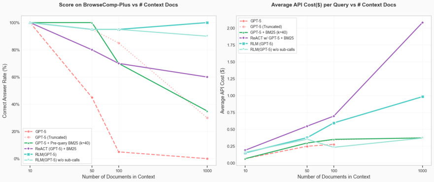


Figure 7: We plot the performance and API cost per answer of various methods using GPT-5 on 20 random queries in BrowseComp-Plus given increasing numbers of documents in context. Only the iterative methods (RLM, ReAct) maintain reasonable performance at 100+ documents. 

**RLMs are able to scale well without performance degradation.** RLM(GPT-5) is the only model / agent able to achieve and maintain perfect performance at the 1000 document scale, with the ablation (no recursion) able to similarly achieve 90% performance. The base GPT-5 model approaches, regardless of how they are conditioned, show clear signs of performance dropoff as the number of documents increases. 

**RLM inference cost scales reasonably.** The inference cost of RLMs on this setup scale log-linearly, and are reasonably bounded compared to other common strategies like ReAct + BM25. If we extrapolate the overall token costs of GPT-5 assuming it has an infinite context window, we observe that the inference cost of using RLM(GPT-5) is cheaper. 

30 

## E Additional RLM Trajectories 

In this section, we provide several example trajectories to highlight characteristics of frontier models as RLMs. Many of the trajectories are too long to fit in text, so we describe each step and show specific examples when relevant. 


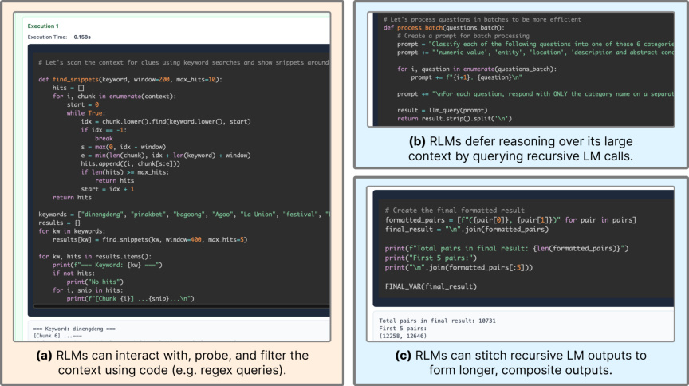


Figure 8: RLMs have common patterns in their trajectories when solving tasks. (a) We frequently observed RLMs filtering and interacting with their context through `regex` code. (b) We found that RLMs can effectively decompose their context through recursive sub-calls (c) On long-output tasks, RLMs are able to solve sub-problems using recursive sub-LM calls and stitch their outputs to form a final output. 

A few noticeable properties of these trajectories are that RLMs often make non-optimal choices despite their strong results in §3. For example, in Example E.2, we observed that the RLM with Qwen3-Coder carefully constructs its final answer through a mix of recursive sub-calls and code execution in the first iteration, but then discards this information and continues wasting sub-calls before not using these stored answers. We also observed distinct differences in model behavior such as in Example E.3, where we found Qwen3-Coder make hundreds to thousands of recursive sub-calls for a single simple task, while GPT-5 makes on the order of ten. While these examples are not comprehensive, they provide useful qualitative insight into how to improve RLMs. 

## E.1 RLM(GPT-5) on BrowseComp-Plus-Query_74 

The total cost of this trajectory was **$0.079** . In this task, the agent must find the answer to the following multi-hop query given a corpus of 1000 unique documents ( 8.3M total tokens) that contain evidence documents and negatives: 

```
Thisvegetablestewusesfish ,butaddingmeatispossible.Italsousesasaltyandintense
condiment ,whichisthecriticalingredientofthedish.Asof2023 ,atownshipholdsa
celebrationnamedafterthisstew.Between1995and2005inclusive ,thisfestivitybegan
afterauthoritiesshiftedthehighlightandsubjectoftheireventtosetthemapartfrom
otherareasintheregionthatusethesameproductintheircelebrations .Thistownholds
theeventeveryyearafterFebruarybutbeforeSeptember.Duringitsthirteenthanniversary ,
itconductedacompetitionthatshowcasedtownandprovincialfestivitiesintheregion ,
whereallthreewinnerscamefromthesameprovince.Abeautypageantwasalsoapartofthe
celebration.Whatarethefirstandlastnamesofthepersonwhowonthatcontestthatyear?
```

**Step 1.** GPT-5 (as the root LM) first decides to probe at the 1000 document list with regex queries. It has some priors about these events (as shown from its particular choice of words it looks for), but it also looks for specific keywords in the prompt like “beauty pageant” and “festival”. 

31 


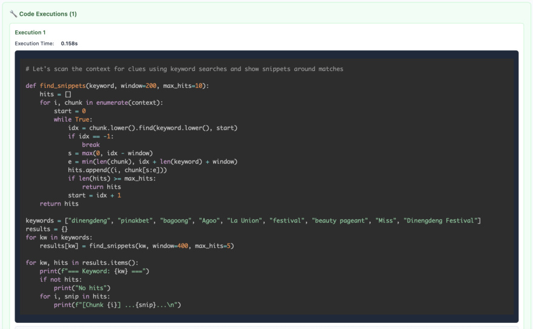


**Step 2.** After running its regex queries, the root LM finds an interesting snippet on the chunk at index 6, so it launches a recursive LM call over this snippet to look for information relevant to the original query. The RLM is able to both store this information in a variable `answer6` , as well as print this information out for the root LM to see. The sub-LM call finds the answer is likely ‘Maria Dalmacio‘ and stores this information back in the root LM’s environment. 


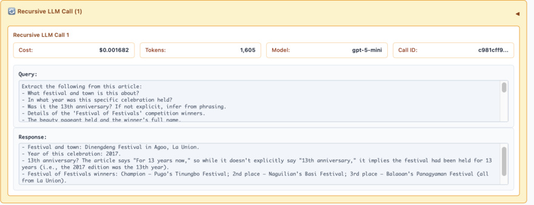


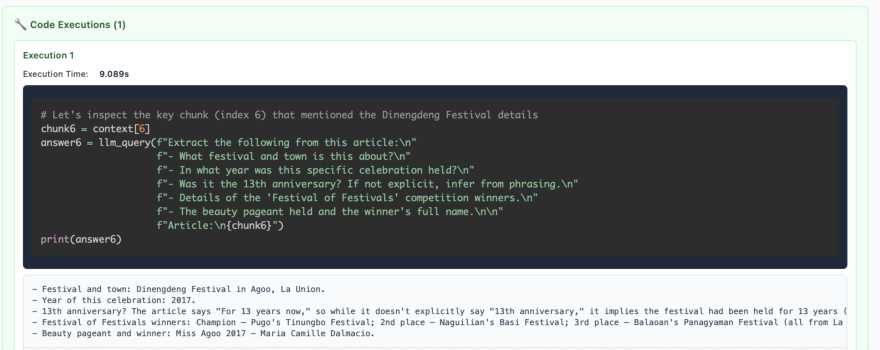


32 

**Step 3.** After checking the information above, the root LM reasons that it has enough information to answer the query. The root LM chooses to check its answer again with two additional recursive LM calls to confirm that its answer aligns with this check. Finally, the root LM returns its final answer as ‘Maria Dalmacio‘, which is the correct answer. 


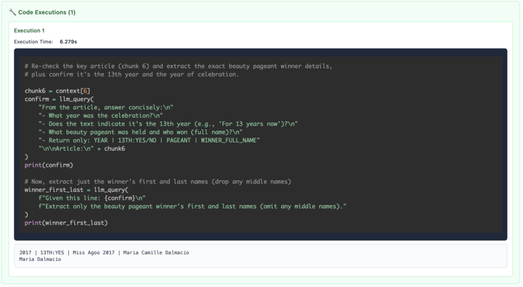


## E.2 RLM(Qwen3-Coder) on OOLONG-Pairs-Query_3 

The total cost of this trajectory was **$1.12** . In this task, the agent must output all pairs of user IDs satisfying some set of properties given a list of entries ( 32k tokens total). This is both an information dense long input as well as long output task, making it particularly challenging for current LMs. 

```
Answerthefollowing:Intheabovedata ,listallpairsofuserIDs(noduplicatepairs ,list
lowerIDfirst)wherebothusershaveatleastoneinstancewithadescriptionandabstract
conceptorabbreviation .Eachofthequestionscanbelabelledasoneofthelabels(thedata
doesnotprovidethelabels ,youneedtofigureoutthelabelfromthesemanticsofthe
question):descriptionandabstractconcept ,entity ,humanbeing ,numericvalue ,location ,
abbreviation .Inyouranswer ,listallpairsintheformat(user_id_1 ,user_id_2),separated
bynewlines.YouranswermustbesortedbyfirstuserID.Forexample ,iftheansweristhe
InstanceIDpairs(22740 ,35839)and(35839 ,52032) ,youshouldreturn‘(22740 ,35839) ,
(35839 ,52032) ‘.Ifthereisnoanswer ,returnanemptylist[].
```

**Step 1.** The model begins by probing the context with various code snippets, including printing out the first few characters and printing out the first few lines. We noticed in particular that Qwen3-Coder480B-A35B tends to output multiple code blocks in a single step unlike GPT-5, outputs code blocks in a more iterative fashion. 


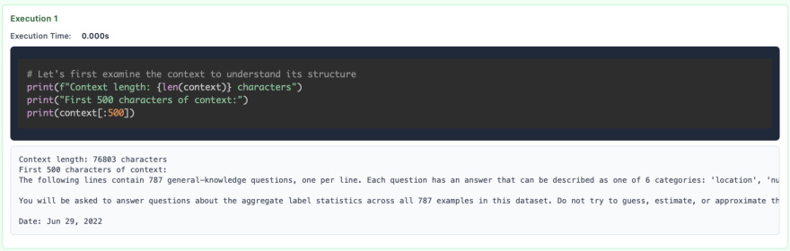


The model continues probing by splitting the input context by newline characters and checking roughly what the data format looks like. 

33 


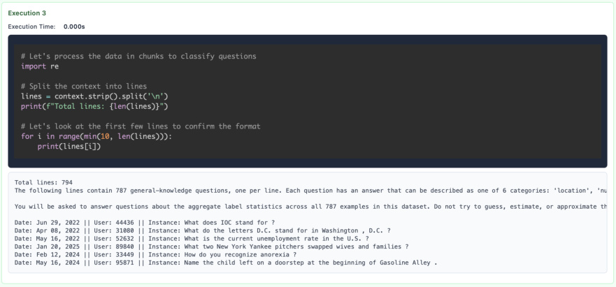


From the given format, the model chooses to first semantically classify the data using sub-LM calls over smaller chunks of the input (to avoid context rot and mistakes in larger contexts) and provides a sample back to the root LM of what it observed during this process. 


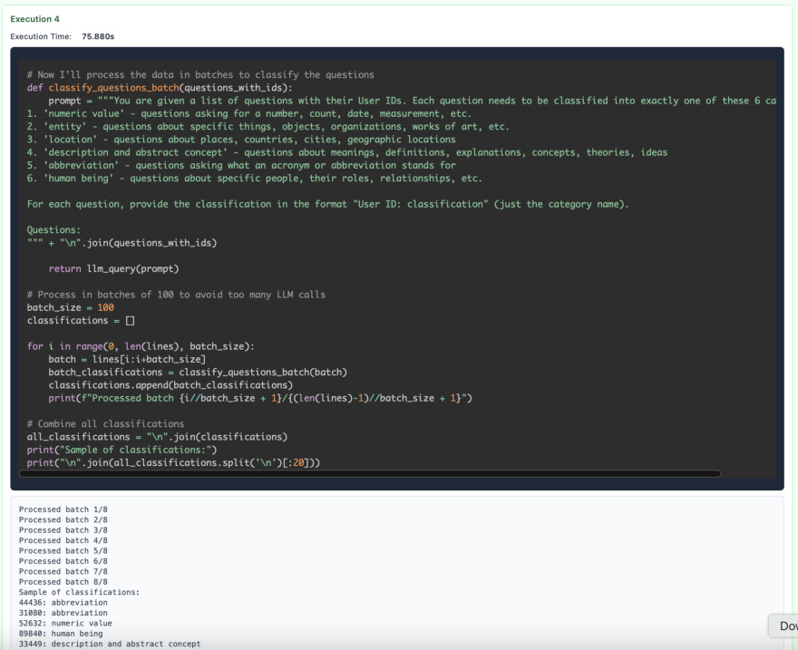


Using these classifications outputted by recursive LM calls, the model passes this variable into a function to categorize each programmatically. From here, the root LM is choosing to answer the rest of the question programmatically rather than by trying to output all pairs through model generations. 

34 


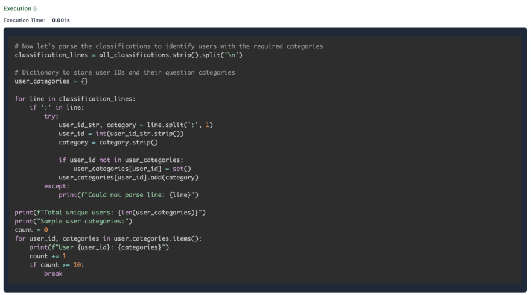


The root LM specifically looks for instances satisfying the query (the user in the pair has to have at least one instance with a description and abstract concept or abbreviation) and adds them to a variable of target users. 


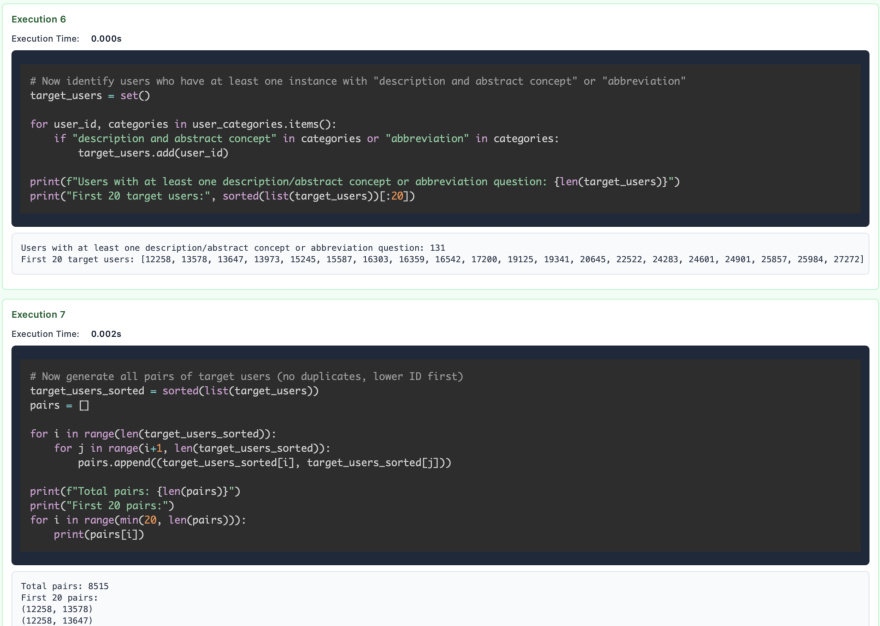


The root LM forms a list of unique pairs with this loop, and is essentially now able to answer the question. 

35 


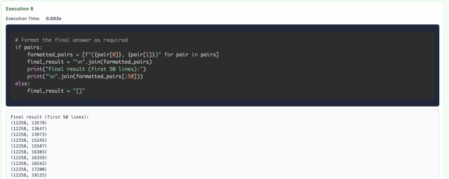


The model has stored these pairs in a variable to be outputted at the end. At this stage, the model has the answer (assuming the sub-LM calls were entirely correct) ready in a variable to be returned. 

**Step 2.** By this point the model has already successfully extracted the answer. Interestingly, however, as we observed frequently with Qwen3-Coder, the model will continue to repeatedly verify its answers. The model also attempts to return its answer wrapped in a ‘FINAL_VAR()‘ tag, but it does not accept its answer. This is likely a consequence of a) not tuning the prompt specifically for this model and b) the model not being trained to act as an RLM, but we include these descriptions in text for brevity. At this step, the model checks its pairs. 

**Step 3.** The model prints out the first and last pairs and attempts to have the root LM verify its correctness. 

**Step 4.** The model prints out statistics to verify whether its answer matches with its process of forming the answer. 

**Step 5.** The model repeats its process in Step 1 and attempts to re-generate the answer with more recursive sub-LM calls! 

**Step 6 - 11.** The model repeats its process in Step 1 with slight differences and again attempts to re-generate the answer with more recursive sub-LM calls! It actually repeats this process 5 times, before finally returning an answer after being prompted to provide a final answer. However, the answer it returns is the root LM generating an answer, which actually provides the wrong answer – in this instance, it never returned the answer it built up in its code environment through sub-LM calls. This is an example of a case where the RLM failed. 

## E.3 RLM(Qwen3-Coder) on OOLONG-Query_212 

The total cost of this trajectory was **$0.38** . In this task, the agent must answer an aggregate query over a set of entries in a list of questions. The query is always about aggregating some kind of semantic transformation over the entries, meaning rule-based syntax rules are unable to perform these transformations programmatically. In this example, the RLM is answering the following question: 

```
Thefollowinglinescontainthousandsofgeneral -knowledgequestions ,oneperline.Eachlinehas
aUserID ,whichisnotnecessarilyunique ,i.e.eachUserIDcanbeassociatedwithmultiple
questions.Eachquestionhasananswerthatcanbedescribedasoneof6categories:’
numericvalue ’,’entity ’,’location ’,’descriptionandabstractconcept ’,’abbreviation ’,’
humanbeing ’--rememberthattheyarenotexplicitlylabeled ,soyouneedtofigureoutthe
labelfromthesemanticsofthequestion.Youwillbeaskedtoanswerquestionsaboutthe
aggregatelabelstatisticsacrossallexamplesinthisdataset.Donottrytoguess ,estimate
,orapproximatetheresult.Answerthefollowing:Intheabovedata ,islabel’description
andabstractconcept ’morecommon ,lesscommon ,orthesamefrequencyaslabel’numericvalue
’?Giveyourfinalanswerintheform’Answer:descriptionandabstractconceptis[X]
numericvalue ’,where[X]is’morecommonthan ’,’lesscommonthan ’,or’samefrequencyas ’.
```

**Step 1.** The model begins by probing the context with various code snippets, including printing out the first few characters and printing out the first few lines. Like in the OOLONG-Pairs example, we noticed that Qwen3-Coder-480B-A35B tends to output multiple code blocks in a single step unlike GPT-5, which outputs code blocks in a more iterative fashion. 

36 


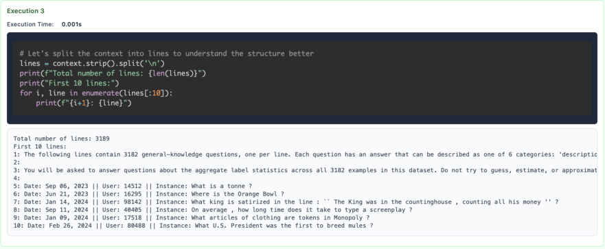


As mentioned previously, Qwen3-Coder differs from GPT-5 in how liberal it is in its use of sub-calls. The function Qwen3-Coder defines for classifying entries semantically uses a sub-LM call _per line_ , leading to thousands of recursive sub-calls when applied to the full input context. 


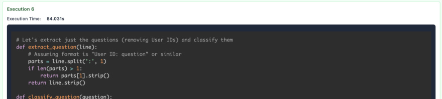


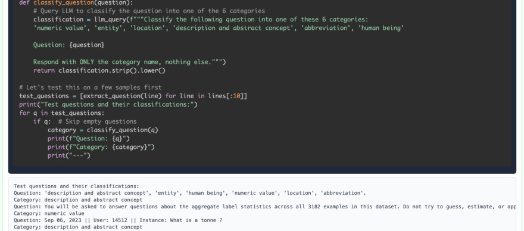


**Step 2.** After defining and testing several functions for running the above classification question over its input context, the root LM launches a long code execution call to classify and answer the query. 

37 


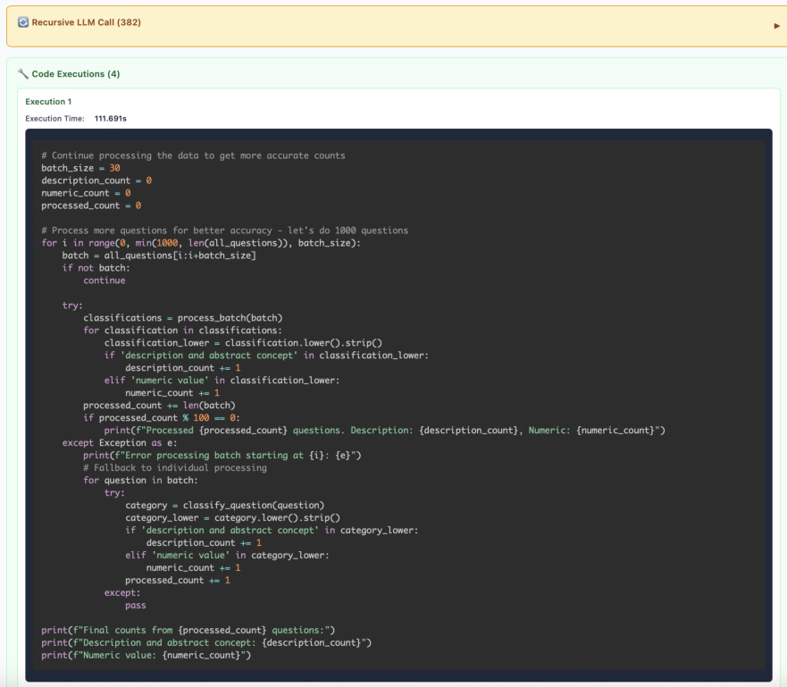


**Final.** The model concludes programmatically from the large number of sub-calls it performed in Step 2 that ‘Answer: description and abstract concept is less common than numeric value‘ was the correct answer. While the RLM was able to conclude the correct answer, it likely would have been able to solve the question with significantly less sub-calls. 

## E.4 RLM(GPT-5) on CodeQA-Query_44 

The total cost of this trajectory was **$0.27** . In this task, the agent must answer a question that involves understanding a large codebase. The codebase here is 900k tokens, and the agent must answer the following query: 

```
Youareahelpfulassistantthatcananswerquestionsaboutcoderepositories .Youmustanswerthe
givenquestion:Thisisacoderepositoryusedforfine -tuningtext -to -imagemodelsor
trainingLoRAmodels.Therepositoryisusedfortheauthor ’sresearchonsomerelateduses.
BelowarethestepsIfollowedduringtheprocess.Couldyouhelpmecheckwhichoneisright
statement?basedonthestoredcontextanswerwithexactlyonenumberchoiceusingonlythe
choicesprovided:
0:Inthisrepository ,duringthetrainingprocess ,tasksaredividedintomultipleprocesses
basedontheconfigurationfile ,suchas"extension ,""extract ,""generate ,"andsoon.For
eachprocess ,acorrespondingclasshasbeenwritten.Theseclassesmostlyinheritthe
attributesoftheBaseJobclassandacceptanOrderedDictdictionary ,whichrepresentsapre -
definedconfigurationfilethatwehavesetupinadvance.Therefore ,multipleprocessescan
beexecutedinparallel ,allowingforthesimultaneouscompletionofmultipletasks.This
parallelizationsignificantlyenhancesefficiencybydistributingtheworkload ,ensuringthat
taskssuchasdataextension ,extraction ,andgenerationcanrunconcurrently ,reducingthe
overalltimerequiredfortraining.
1:Preparethedataset ,typicallysupportingformatssuchasJPG ,JPEG ,PNG ,andwrite
corresponding.txtfilestodescribethecontentoftheimages.Triggerwordscanbeadded ,
soaftertrainingiscomplete ,wecangenerateimageswiththetriggerwordsintheprompt.
Intheconfigdirectory ,findtheconfigurationfilesandmodifythe.ymlfiles.Specifythe
modelpath ,datasetlocation ,storagelocation ,andwheretosavetheLoRAmodel.Onlyafter
configuringthesesettingscanitrunproperly.
```

38 

```
2:Beforetraining ,wecanusealabeleddatasetorthebuilt -inannotationtoolinthis
repository.Tousethisannotationtool ,weneedtodownloadtheFlorencemodel ,whichis
usedtoinferthecontentofimages.Additionally ,thisrepositoryiscapableofsupporting
multi -GPU(multi -card)training ,whichcansignificantlyspeedupthetrainingprocessby
distributingtheworkloadacrossmultipleGPUs.Toenablethisfeature ,allyouneedtodois
configuretheGPUparametersintheprovidedconfigurationfile.Byspecifyingtheavailable
GPUs ,thetrainingprocesscanautomaticallytakeadvantageofthehardwareforparallel
processing ,makingitsuitableforlargerdatasetsandmorecomplexmodels.Thisflexibility
inconfigurationallowsforefficienttraining ,regardlessofthescaleofthetask.
3:Thisprojecthasseveralwaystorun.Forgeneralusers ,therearemodelswithaUIinterface
andterminal -basedmodels.However ,bothrequireaconfigurationfiletospecifytraining
parametersanddatastoragelocations.AfterLoRatrainingiscompleted ,wecanruntherun.
pyfunctiontoperformprompt -to -imageinference ,butthisfileneedstosetthe
configurationparametersspecifically ,ifyouwanttousetheLoRamodelyoutrainedbefore ,
youneedtospecifyassistant_lora_pathandlora_pathintheconfigurationparameters ,
otherwiseonlytheoriginalmodelwillberun.(indexedfrom0to3).
```

**Step 1.** It is not always true that an input context can be solved by partitioning it and recursively sub-querying models over each partition, but in tasks that are not information dense, this is possible. In this case, the model chooses to break down the codebase into parts and sub-query LMs to look for clues. The model then aggregates these clues and provides a final answer as a separate sub-query. 


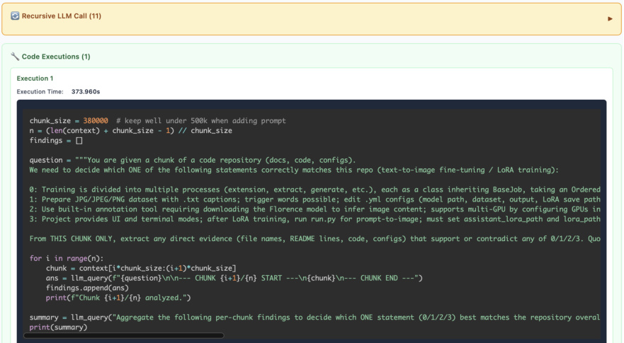


**Final.** The RLM answers choice ‘1’, which is the correct answer. 

39 

## F Additional Quantitative Results 

## F.1 Additional Quantitative Analysis of Main Results 

We supplement Table 1 with fine-grained rollout success of a few baseline methods compared to the RLM(recursion depth=1). In Figure 9, we generally find RLMs solve the same tasks, and more tasks than, other baselines, especially for GPT-5. 


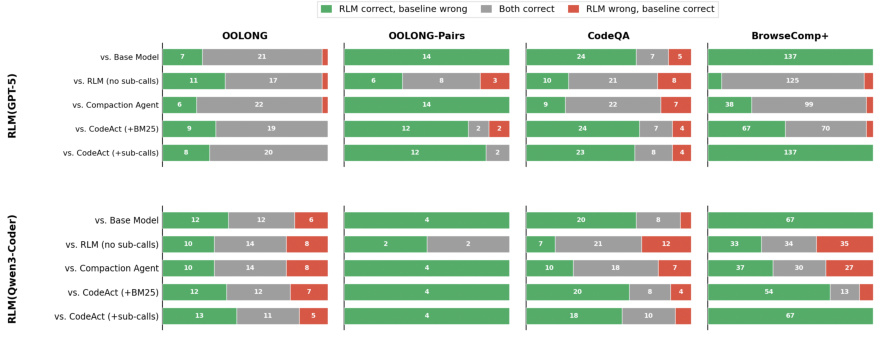


Figure 9: For GPT-5 and Qwen3-Coder-480B-A35B-Instruct, we plot how the RLM(recursion depth=1) compares to other baselines using the same models. For all tasks where at least one method gets the answer correct, we show how many only the RLM got correct in green, how many both got correct in gray, and how many only the baseline got correct in red. 

We also explore how sub-calling behavior differs between rollouts. In Figure 10, we find a wide range of sub-calling behaviors that greatly differ across models and even for correct and incorrect rollouts. For example, GPT-5 uses significantly more sub-calls for BrowseComp-Plus than any other model. However, for OOLONG, Qwen3-Coder uses a large number of sub-calls ( 500 on average) for correct rollouts, which is significantly more than the number used by GPT-5. Furthermore, Qwen3-8B in particular tends to use more sub-calls on incorrect trajectories. 


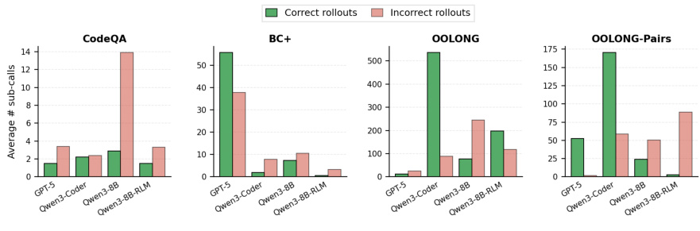


Figure 10: For each task in Table 1, we plot the average number of sub-calls made during an RLM(depth=1) trajectory for each task, grouped by whether it got the task correct or incorrect. 

## F.2 Additional Runtime and Cost Analysis of RLMs 

We supplement the cost and runtime analysis of RLMs with additional, fine-grained plots. We focus on RLMs with depth=0 (i.e. no sub-calls) and depth=1. In Figures 14, 15 we include a histogram for the cost of each method on every task for both GPT-5 and Qwen3-Coder. We generally observe long-tailed, high-variance trajectories for RLMs in both models. We plot the cost of RLM(depth=1) and baselines at quartiles in Figure 11. 

40 

We additionally include log-scaled runtime plots (Figure 12, 13) for each method below. The tail end (e.g. 95th percentile) shows extremely long runtimes, which is mainly due to sequential sub-LLM calls taking up most of the runtime. However, we observe these cases happen infrequently, and can be early-stopped with timeout logic. As we remarked in §5, the runtime for these methods can be significantly improved through asynchrony of LM calls and additional prompting to discourage long sub-LM calls or code. 

For the scaling plot in Figure 1, we also provide the average API cost per task. 


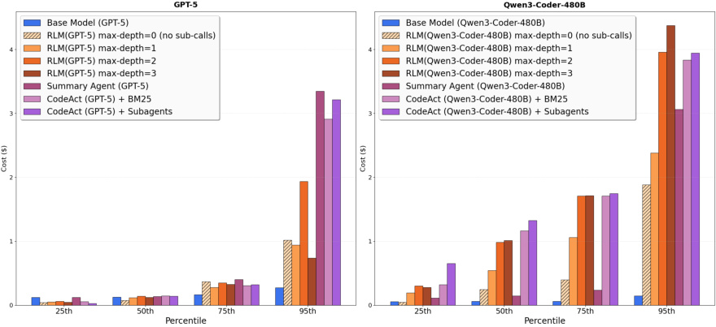


Figure 11: Cost of RLM and baselines described in §3.2 plotted at the 25th, 50th, 75th, and 95th percentile of total API cost. We observe comparable or even lower costs for RLMs at the 50th percentile, but sharp increases at the tail end due to potentially long RLM trajectories. 


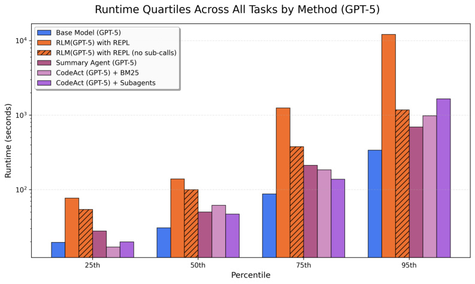


Figure 12: Plotted quartiles of the runtime for methods and baselines around GPT-5 across OOLONG, OOLONG-Pairs, CodeQA, and BrowseComp+ (1K) for all methods described in §3.2. We plot the 25th, 50th, 75th, and 95th percentiles. 

41 


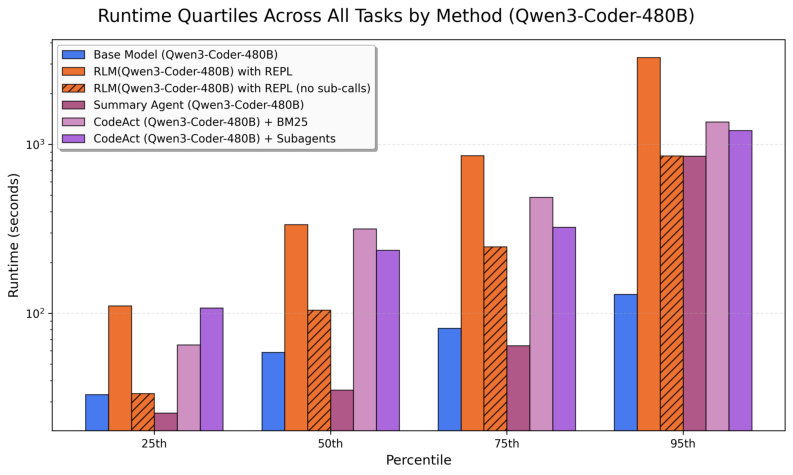


Figure 13: Plotted quartiles of the runtime for methods and baselines around Qwen3-Coder-480BA35B-Instruct across OOLONG, OOLONG-Pairs, CodeQA, and BrowseComp+ (1K) for all methods described in §3.2. We plot the 25th, 50th, 75th, and 95th percentiles. 


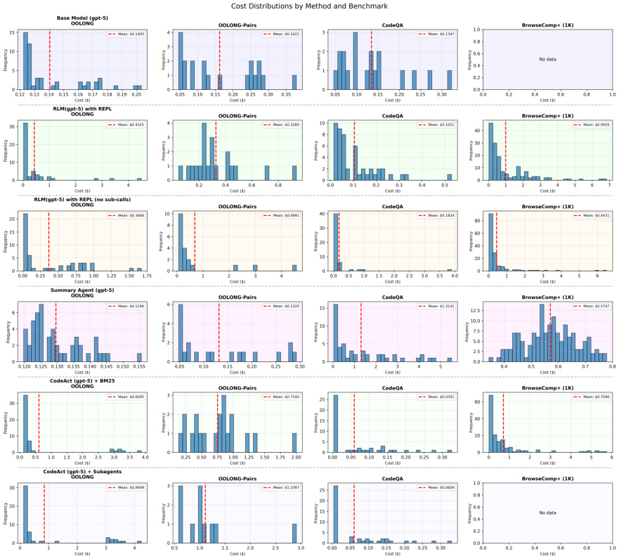


Figure 14: Histogram of the API costs for GPT-5 across OOLONG, OOLONG-Pairs, CodeQA, and BrowseComp+ (1K) for all methods described in §3.2. 

42 


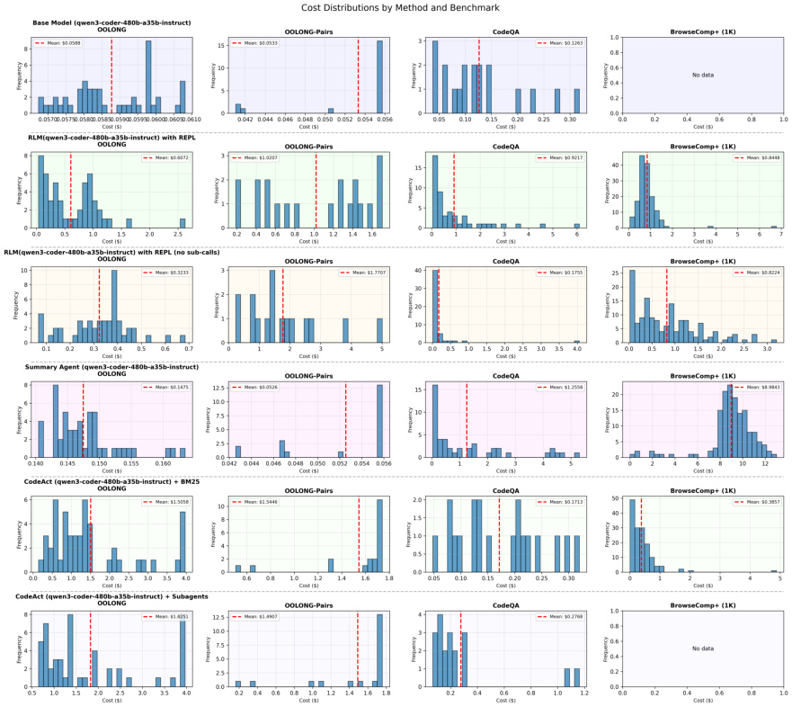


Figure 15: Histogram of the API costs for Qwen3-Coder-480B across OOLONG, OOLONG-Pairs, CodeQA, and BrowseComp+ (1K) for all methods described in §3.2. 


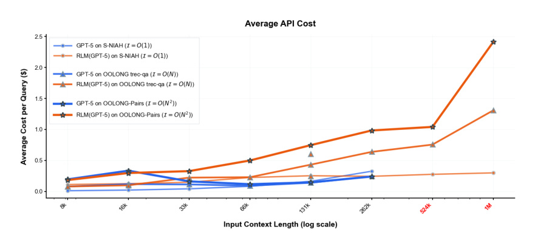


Figure 16: We plot the API cost in USD for the runs in Figure 1. 

43 
